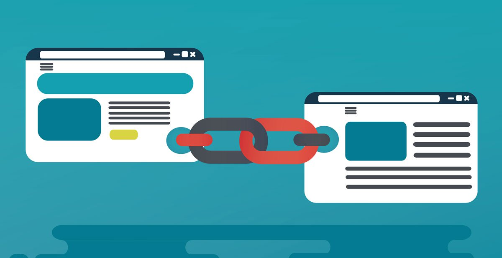
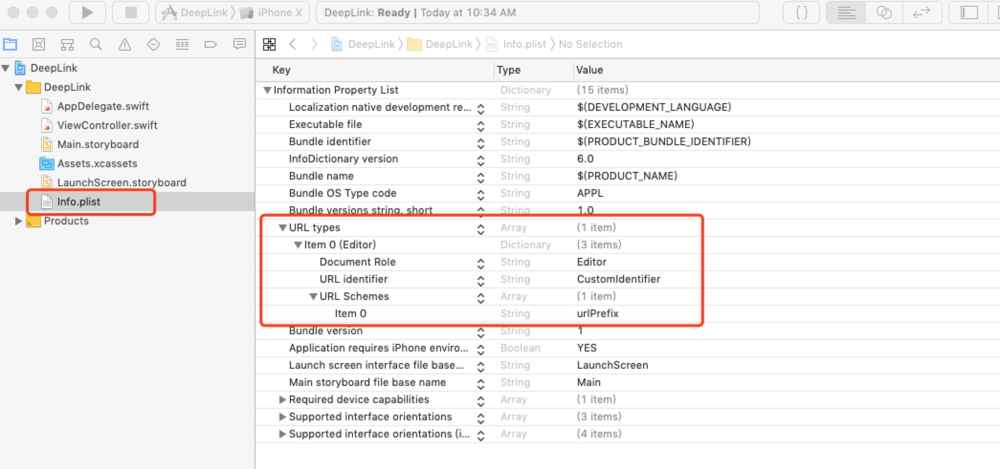
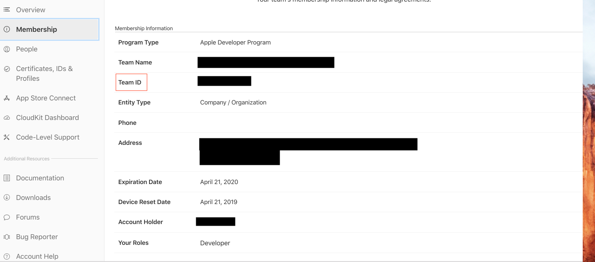
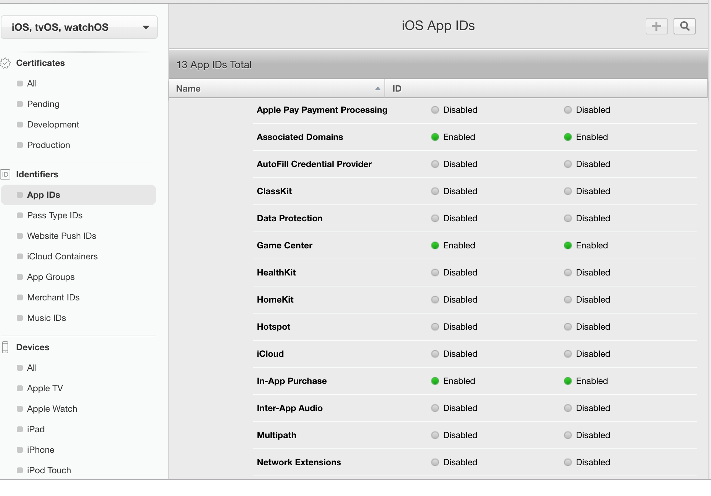
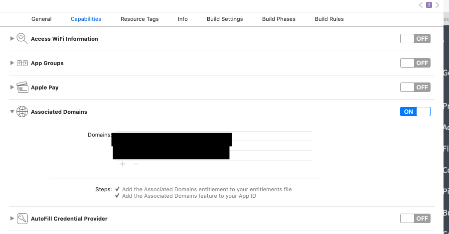
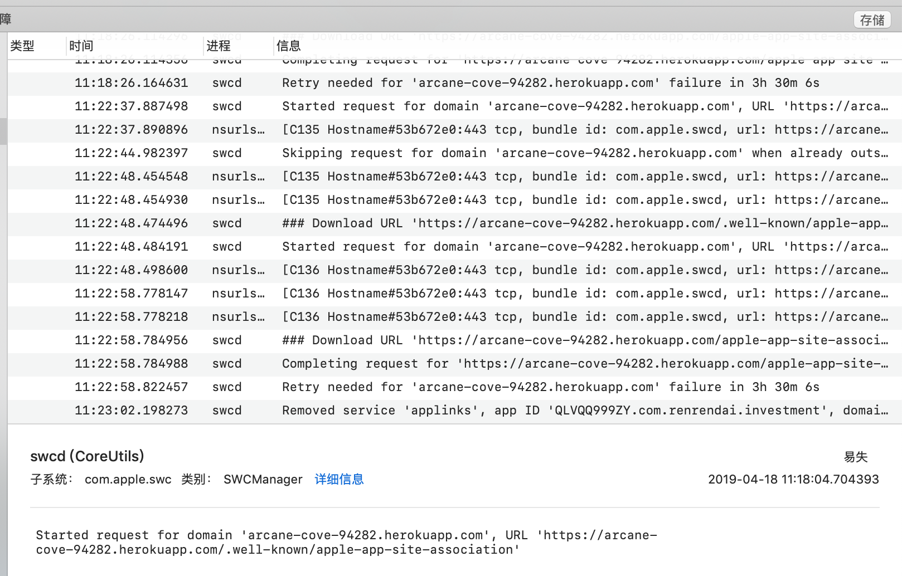

## iOS DeepLink


### 什么是Deeplink
使用统一资源标识符（URI）链接到一个App中特定的位置，而不是简单地打开App。 即使用户未安装App的情况下，一样可以在用户安装App后重新还原用户之前预览的页面。常见的有以下2种实现方式。
### URL Scheme (iOS8以上可用)

我们通常只能使用scheme。这种方式需要通过safari中唤醒APP，但是这种方式需要提前判断系统中是否安装了能够响应此scheme的app，并且这种方式在微信等中是被禁用了的。如果没有安装app则该链接变成了无效链接。

#### 如何支持 URL Scheme
设置info.plist


假如我`URL Schemes`填写的是`rrddl`，`Identifier`填写的是 `renrendai.com`。那么我就可以在Safari地址栏中输入`rrddl://renrendai.com`来打开我们的app。
##### 原理
iPhone在安装应用时可以检测到`info.plist`文件中是否有`CFBundleURLTypes`，如果存在则将相应的Schemes注册到系统中，如有其它app通过
```
UIApplication.shared.openURL(URL(string: "rrddl://renrendai.com")!)
```
或者safari打开时，系统会查找已注册的Schemes来启动对应的app。
##### 如何限制url打开app
如果不想被其它应用无端调起可以在`AppDelegate`中`open url`方法中通过host和path等条件加以限制。
```
func application(_ app: UIApplication, open url: URL, options: [UIApplication.OpenURLOptionsKey : Any] = [:]) -> Bool {
let components = URLComponents(string: url.absoluteString)
let pathPool = ["dl", "h5", "tab"]
if pathPool.contains(components?.path ?? "") {
JumpManager.handel(url)
return true
}
return false
}
```
#### 缺点
1.不能检测用户是否安装了app，对没有安装app的用户没有引导作用。

2.没有唯一的应用标识，无法保证用户不会安装注册相同URL方案的第三方app。

### Universal Links
Universal Links就是一个通用链接，iOS9以上的用户，可以通过点击这个链接无缝的重定向到一个app应用，而不需要通过safari打开跳转。如果用户没有安装这个app，则会在safari中打开这个链接指向的网页。
#### Universal Link的基本运作流程
一  app第一次安装或者版本更新后第一次启动，app向工程里配置的域名发起Get请求拉取`apple-app-association`这个Json文件。

二  app将`apple-app-association`注册给系统。

三  由iPhone上的任意webView发起跳转的url(在`webKit`做了处理)，如果是`apple-app-association`注册的通用链接则打开App，触发Universal Link delegate；没命中，webView继续跳转url。
#### 如何让app支持Universal Links
1.创建一个名字叫做`apple-app-site-association`，包含固定格式的`json`文件
```
{
"applinks": {
"apps": [],
"details": [
{
"appID": "teamID.bundleId",
"paths": ["/deaplink","/wwdc/news/","*"]
}
]
}
}
```
##### 注意:  
##### appID 的 格式为 `teamID.bundleId`形式。
##### `apple-app-site-association`不能带后缀名
##### `apple-app-site-association`放置位置
1.文件配置完成之后，将其上传到你的服务器根目录或者`.well-known`这个子目录下(iOS 9.3才可以)

2.确保使用` https://yourdomain.com/apple-app-site-association` 这个链接可以访问到，`yourdomain.com`为你的服务器域名。

#### 在哪里获取`TeamID?`



##### paths规则
1.使用`*`配置，则整个网站都可以使用。

2.使用特定的URL，例如`/user/home`来指定某一个特殊的链接。

3.在特定URL后面添加*，例如`/user/*`, 来指定网站的某一部分。

4.除了使用*来匹配任意字符，你也可以使用 ?来匹配单个字符，你可以在路径当中结合这两个字符使用，例如 `/user/*/201?`。

#### app IDs 配置
进去登录苹果开发者中心，在`identifiers`下`App IDs` 打开`Associated Domains`开关。



#### 项目配置


`domains`可以添加多个，前缀必须为`applinks:`，`applinks:`后为你的服务器的域名。值得注意的是要想触发Universal Link拦截必须跨域，假如Universal Link配置的是 `wx.renrendai.com` 这个域名，并且对这个域名下比如`/point/home/user` 等urlPath进行了识别，也就是说只有当你访问 `https://wx.renrendai.com/point/xxx` 才会触发Universal Link拦截，而正经的Url `https//www.renrendai.com/point/xxx` 是不会触发Universal Link的拦截。

#### 验证Universal Links配置是否成功
1. 快捷验证，在备忘录中输入` https://yourdomain.com/apple-app-site-association` 长按这个链接，出现在`XXXapp`打开即为成功。(在信息里同理)

2. 使用 [苹果官方验证](https://search.developer.apple.com/appsearch-validation-tool/)验证文件是否能被苹果请求到。

#### 项目中需要做的处理
```
func application(_ application: UIApplication, continue userActivity: NSUserActivity, restorationHandler: @escaping ([UIUserActivityRestoring]?) -> Void) -> Bool {
if userActivity.activityType == "NSUserActivityTypeBrowsingWeb" {
let url = userActivity.webpageURL
JumpManager.handel(url) //处理url跳转
return true
}
return false
}
```
###  参考资料
[苹果官方文档](https://developer.apple.com/library/content/documentation/General/Conceptual/AppSearch/UniversalLinks.html)

[好的文章](http://www.cocoachina.com/articles/20463)

### 遇到问题:
1. 官网说`apple-app-site-association`放置在服务器根目录或者`.well-known`这个子目录下即可,在真机模拟是发现在`iOS9.3-iOS12` 请求的地址是在`.well-known`下而非根目录下

## 广告时间
最后惯例，欢迎大家star我们的[人人贷大前端团队博客](https://link.juejin.im/?target=https%3A%2F%2Fgithub.com%2Frrd-fe%2Fblog)，所有的文章还会同步更新到[知乎专栏](https://www.zhihu.com/people/ren-ren-dai-da-qian-duan-ji-zhu-zhong-xin/activities) 和 [掘金账号](https://juejin.im/user/5cb690b851882532941dd5d9)，我们每周都会分享几篇高质量的大前端技术文章。如果你喜欢这篇文章，希望能动动小手给个赞。
