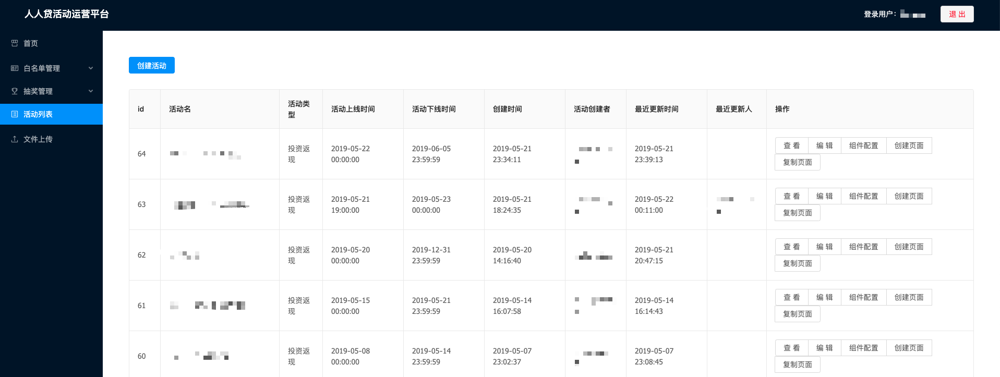

***

> 人人贷活动运营平台，是一个由人人贷大前端团队进行开发和维护，并用于自动化、可视化构建人人贷常规活动的系统。本文将会分享"人人贷活动运营平台"的设计思想和部分技术实现，希望对大家有所帮助。

## 一、背景

人人贷前端团队在过去的几年里，接到了很多来自市场部门的活动开发需求，这些活动主要分为4大类：

* LP活动（Landing Page，引导页），用于新人注册的活动页面，基本都是一个注册框 + 若干产品卡
* MGM活动（Members get member），用于好友间邀请拉新的活动页面，一般包括邀请记录，邀请排行，分享等功能
* 常规活动，一般包括抽奖、产品卡、排行榜、分享等功能，用于促进销量
* 特殊活动，一般是游戏页面，相同的形式基本只会使用一次

### 1.1 活动开发人力瓶颈和上线周期长

一个普通的活动（包括上述的LP活动、MGM活动、常规活动）开发时间得多久？

正常情况下，一个涉及到H5和PC两端的简单活动，从产品提出需求开始，设计师需要`2人*2天`来完成设计工作，开发需要`3人*2天`（包括H5、PC端页面、后端接口开发、接口联调），测试需要`2人*2天`投入。

就这样，从需求提出到页面上线，需要一共投入`14人*天`的人力资源，得 **7个工作日** 才能完成。

而遇到比较紧急的活动开发需求，上线周期需要压缩，大家都得加班来完成。

另外，由于公司财务结算的特殊性，很多活动的开始时间一般都是凌晨，开发、测试人员需要确认活动在线上运行正常，才能下班。

### 1.2 活动功能重复和反复修改

随着公司业务的发展，活动的开发需求越来越多。前端团队有三分之一的人力，长期投入在活动页面的开发中。

事实上，咱们大部分的普通活动，功能并不复杂，而且大部分的功能比较重复。

这种功能重复性的页面开发，对于个人和团队的成长来说，并没有太多的价值。而且活动上线后，经常因为样式和文案的关系，需要修改代码，重新上线，导致团队成员普遍比较反感这种普通活动的开发。

期间，团队也提出过组件化开发的方式，试图将不同的功能模块抽取出来，在不同的活动页面上进行引用，以便节省开发时间。但由于设计方案的不确定性，以及不同开发人员参与，这种抽取的功能模块复用性不太高，效果不是特别理想。并且不能解决样式和文案修改，需要重新上线的问题。

总之，普通活动的特点是：页面功能大同小异、开发时间紧、下线快、技术成长低。

随着团队的技术体系日益成熟，我们终于腾出精力，试图解决普通活动开发中各项痛点。

## 二、人人贷活动运营平台

早在十几年前，使用`Dreamweaver`就能可视化地搭建出前端静态页面。虽然`Dreamweaver`已经成为过去式，但是可视化搭建的思想，却被广泛使用。

我们在调研业界常用解决方案中发现，很多公司都有自己的活动运营系统，可用来高效、可视化地配置活动，以及监控活动运营数据。我们希望采用这种活动页面可视化搭建的思想，由运营人员根据实际的运营需求，自行添加活动，并配置对应的活动页面。



### 2.1 整体框架

首先，简单介绍下人人贷前端的开发模式。

随着 Node.js 的兴起，我们从2016年开始，将原有基于 JSP 的前端开发模式，改造成使用 Node.js 做中间层，进行前后端分离的模式。


人人贷前端使用的就是图中所示的前后端分离的开发模式（图片来自[Web 研发模式演变](https://github.com/lifesinger/blog/issues/184)），这种开发模式下，前后端的职责清晰。对于前端来说，两个UI层各司其职：`Front-end UI layer` 处理浏览器层的展现逻辑，`Back-end UI layer` 可以用来处理路由、模板、数据获取、cookie、服务器端渲染等。

在这种前后端开发模式下，整个人人贷活动运营平台的架构图如下：


整个运营平台系统分为四大块。

1、组件库。运营平台采用了业界通用的 `组件化` 方案，并且选用 `React.js` 作为组件的开发库。下面会详细介绍组件库的拆分和开发模式。

2、前端系统。整个运营平台包括  `积木系统` 、 `rrd-h5` 、`rrd-pc` 三个前端系统。其中 `积木系统` 是运营创建、编辑、发布活动页面的系统，属于内部系统。而`rrd-h5` 和 `rrd-pc` 属于面向用户的`Back-end UI layer`，它们是基于生成的活动配置数据，对活动页面进行渲染及提供异步接口，以供用户访问。

3、后端接口。在后台服务上，由于活动并不是特别复杂，我们有较大一部分接口，比如抽奖、记录收获地址，只是做一些简单的存储或者计算，就直接使用了`Node.js`实现，也就是上图中的`node-market-service`服务。而部分与公司主营业务相关的接口，比如投资返现这类，还是直接使用后端提供的Java接口。

4、数据层。用于存储活动配置相关的数据以及部分运营数据。

### 2.2 组件库

我们按照功能模块，将往期的活动页面拆分成了不同的组件。

以 [移动端的邀请好友页面](https://m.renrendai.com/mo/user/invite/inviteFriends) 为例，这个页面就包括：图片组件（banner图）、活动规则组件、邀请记录组件、战队排行榜组件、平台增信组件和邀请好友按钮组件等。

组件拆分完成后，我们就得到了一个组件库。

为了便于对组件库进行管理，我们按照所属的平台，将组件库拆分为 `jm-common` 、`jm-mobile` 、`jm-pc` 三类，分别对应两端公用组件、H5组件、PC端组件。

如上文所述，我们的`积木系统`定位为 **可视化编辑平台**，在对组件进行配置后，需要在编辑页面实时展示。`rrd-h5`和 `rrd-pc`服务也需要根据页面的配置数据，对组件进行渲染。

这三个系统中都需要使用组件库，为了方便组件的开发以及预览，我们将组件库的源码集成到了`积木系统`的代码仓库中。

`积木系统`通过项目代码中的组件库源码来加载组件库，当组件的代码有修改，`积木系统`能通过重新编译，刷新页面并预览到新的组件样式。

组件库还会通过开发环境判断，会自动在`编辑系统中`使用模拟数据，方便了组件开发时的测试。

为了方便进行版本管理和组件库接入，当组件开发完成后，我们会将组件库发布在私有的npm仓库中，同时在`rrd-h5`和`rrd-pc`中，更新对应的组件库版本号，就能加载到新的组件。


### 2.3 活动配置与页面配置

在积木系统中，需要先创建活动，然后才能创建该活动对应的移动端、PC端页面，而不是直接创建活动页面。

这是因为根据以往的运营经验，一个活动，是可以对应多个推广页面（至少是H5和PC端两个页面），而这些推广页面需要共享一些活动配置。

数据存储上看，我们新建了 `activity` 、 `page` 、 `page_record` 三张表用于存储活动配置、页面配置和组件配置相关的数据。

* `activity` 是活动配置表，负责记录活动名，活动的上下线时间，业务相关的活动配置以及**公用活动配置**等。其中公用组件配置，是指该活动下的页面，需要公用的组件配置项。比如领取优惠券组件，会将优惠券的金额、类型、批次等，放到公用组件配置中，这样能有效避免在多个页面的组件中分开进行配置时，配置出错或者不统一的情况。

  

* `page` 是页面表。新建页面时，就会往该表中插入数据。信息会记录页面名，页面所属的活动id，页面所属的平台（移动端 or PC端），发布时间等。需要注意的是，该表不会记录具体的组件配置数据。这是为了将页面数据与组件配置数据分离。但是页面表会记录线上页面使用的 online_record_id ，用来关联查询线上页面使用的组件数据。每次发布页面后，我们会将最新的 online_record_id 更新到对应页面数据中。

  

* `page_record` 是组件配置记录表，主要负责记录所属的页面id，具体的组件数据，编辑人，发布时间等。在积木系统的活动页面编辑中，每一次保存页面，都会在这个表中插入一条数据，这样方便查找编辑记录，同时也方便回滚。

  

  

  

### 2.4 组件的配置与配置数据解析

按照我们规划的操作流程，运营同学在 `积木系统` 中新增活动，创建页面后，需要给页面添加组件，修改组件配置，配置完成后，保存页面中的组件配置，最后发布页面。

不同的组件，需要用到不同的配置项。那么我们该怎么在`积木系统`中，给不同的组件提供不同的配置项呢？

首先得介绍一下组件的开发模式。

在开发组件前，我们会提前和产品同事确认该组件所需要的配置，包括组件样式配置、组件文案配置以及组件业务属性配置等。

开发组件时，我们一般会添加三个文件。以图片组件为例，我们添加`image.jsx`、`image.scss`、`spec.js`，分别是组件的具体实现代码、组件样式文件、组件的配置文件数据。

在配置某个组件时，积木系统通过读取该组件下的`spec.js`文件，提供不同的配置弹窗。

以下是图片组件的`spec.js`文件内容：

```javascript
import Image from './image.js';

export default {
    Component: Image,
    type: Image.type,
    _name: '图片',	//组件列表使用的名称
    _platform: 'common', //该组件属于公共组件
    _acceptChild: false, //是否允许嵌套其他组件
    _dataSchema: {  //组件配置项需要的JSON Schema
        type: "object",
        required: ["src"],
        properties: {
            src: {
                type: "string",
                title: "请填写图片地址",
            },
            alt: {
                type: "string",
                title: "图片无法加载时的文案",
            },
            title: {
                type: "string",
                title: "鼠标移到图片上的提示文案",
            }
        }
    },
    data: {  //默认数据
        src: 'https://www.we.com/cms/5864b0d6a24d131067ef7956/jimu/default-img.jpg',
        alt: '',
        title: ''
    },
    style: {  //样式配置项
        width: '',
        height: '',
        position: 'static',
        display: 'block',
        margin: '',
        padding: ''
    },
    _defaultStyle: {  //默认样式
        mobile: {
            width: '100%'
        },
        pc: {
            maxWidth: '1080px',
            height: 'auto'
        }
    }
}
```

以上的配置文件中，有部分属性是以下划线_开头，这部分属性属于`积木系统`专用的属性，会在给前端页面传递组件配置数据时，过滤掉这些专属属性，避免配置数据过多，也避免部分内部数据泄露。

一个活动页面，一般会添加多个组件，而且组件间还可能存在嵌套关系，页面上的组件配置数据如何组织、解析，也是必须要解决的问题。

我们这样定义页面上的组件数据：

```
{
    "dataMap":{
        "id1":{
            "cid":"id1", // 组件id
            "type":"pc_component_1", //组件类型
            "name":"组件一", //组件名
            "platform":"pc", //组件所属的平台
            "acceptChild":true, //是否能添加子组件
            "data":{},//组件数据
            "style":{},//组件样式
            "childs":['id3'] //子组件id
        },
        "id2":{
            "cid":"id2", // 组件id
            "type":"pc_component_2", //组件类型
            "name":"组件二", //组件名
            "platform":"pc", //组件所属的平台
            "acceptChild":false, //是否能添加子组件
            "data":{},//组件数据
            "style":{},//组件样式
            "childs":[] //子组件id
        },
        "id3":{
            "cid":"id3", // 组件id
            "type":"pc_component_3", //组件类型
            "name":"组件三", //组件名
            "platform":"pc", //组件所属的平台
            "acceptChild":false, //是否能添加子组件
            "data":{},//组件数据
            "style":{},//组件样式
            "childs":[] //子组件id
        },
        ...
    },
    "main": ["id1","id2"] //第一层级的组件id
}
```

页面的组件配置数据中有`dataMap`和`childs`两个字段。

在需要通过这些配置的组件数据来渲染页面时，首先使用配置项中的 `main` 字段获取所有第一层级子组件的id，然后在`dataMap`中，根据组件id来查找对应的具体配置，进行渲染。

如果某个组件配置数据中的 `childs` 字段不为空数组，就意味该组件中嵌套了其他组件，就继续通过 `childs` 中的id值，在`dataMap`中查找对应组件的配置数据，并渲染子组件。

还有，我们之前提到过的公共组件配置数据，在渲染组件前，也会和`dataMap`中的对应组件配置进行数据合并。

### 2.5 rrd-h5 & rrd-pc 中如何渲染？

那么`积木系统`中生成的页面组件配置数据，是如何在 rrd-h5 和 rrd-pc 中，进行渲染的呢？

其实，目前主流的组件渲染方式有三种：

- 加载所有的组件定义，然后通过活动id和页面id获取页面的配置数据，进而动态渲染出页面
- 先通过活动id和页面id获取页面的配置数据，然后按需加载组件，渲染出页面
- 服务器通过页面配置和组件定义，直接在发布时生成静态页面

不同的方案各有优劣。rrd-h5 和 rrd-pc 系统中，我们使用了第一种方案来进行渲染：我们的线上页面模板，会默认加载所有的组件。

以`rrd-h5`为例，我们会在活动页面模板中引用所有的 `jm-common`(公共组件) 和`jm-mobile`组件库代码。然后使用活动页面URL中携带的活动id和页面id，通过 `node-market-service` 服务获取活动数据和页面组件配置数据。之后就按上述 `2.4 组件的配置与配置数据解析` 中介绍的组件配置数据解析方式，渲染出整个活动页面。

就这样，用户就能看到配置的活动页面。


## 三、TODO

目前的运营平台，其实主要以`编辑系统`为主，并提供了少量的查询功能。

我们未来会继续迭代，集成`运营监控`、`报警`，`自动生成活动数据报表`等功能。

同时，为了提高页面加载速度，考虑到活动页面上图片较多、且切图普遍较大的问题，我们即将在`rrd-h5`、`rrd-pc`中引入 `webp` 、`http2`、`service-worker`等。


## 四、总结

人人贷活动运营平台在2018年9月上线后，效果极其明显：

* 活动运营平台，能够自动化、可视化地创建活动及活动页面。
* 活动运营平台，让活动的上线周期，从以往的6天，降低到了2天。设计师切完图，运营人员就能配置上线。
* 活动可配置上线和下线时间，开发人员基本不会因为活动的开发而加班。
* 运营平台规范了活动功能的形式，同时，设计师也会在组件的可编辑范围内进行设计，组件可配置项丰富。
* 活动页面的样式和文案的修改，不再需要重新上线。
* 释放出的前、后端开发人员，能将更多的精力投入到对新技术的研究。

由于篇幅有限，活动运营平台的很多具体实现细节并没有过多描述。如果大家有感兴趣的问题，可以留言进行交流。

最后，欢迎大家关注我们的[知乎专栏](https://www.zhihu.com/people/ren-ren-dai-da-qian-duan-ji-zhu-zhong-xin/activities) 或者 [掘金账号](https://juejin.im/user/5cb690b851882532941dd5d9)，我们将每周分享几篇高质量的大前端技术文章。


## 参考文章

* [转转运营活动高效开发有哪些秘诀？](https://juejin.im/entry/5a145a4c5188253ee45b13a3)
* [QQ会员活动运营平台演变实践](http://blog.jobbole.com/108252/)
* [页面可视化搭建工具前生今世](https://zhuanlan.zhihu.com/p/37171897)
* [前端服务化——页面搭建工具的生与死](https://www.cnblogs.com/sskyy/p/6496287.html)
* [积木系统，将运营系统做到极致](https://cloud.tencent.com/developer/article/1055079)
* [美团外卖前端可视化界面组装平台 —— 乐高](https://tech.meituan.com/2017/03/09/waimai-lego.html)
