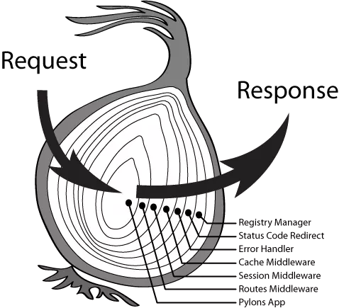

# 从零实现TypeScript版Koa

我们知道Koa框架主要有以下几个重要特性：

* 支持洋葱圈模型的中间件机制
* 封装request、response提供context对象，方便http操作
* 异步函数、中间件的错误处理机制

本文将由浅到深带领大家使用TS逐步完成一个实现了Koa核心功能的简易框架


### 第一步：基础Server运行

目标：完成基础可行新的Koa Server

* 支持app.listen监听端口启动Server
* 支持app.use添加类middleware处理函数

核心代码如下：

```javascript
class Koa {
  private middleware: middlewareFn = () => {};
  constructor() {}
  listen(port: number, cb: noop) {
    const server = http.createServer((req, res) => {
      this.middleware(req, res);
    });
    return server.listen(port, cb);
  }
  use(middlewareFn: middlewareFn) {
    this.middleware = middlewareFn;
    return this;
  }
}

const app = new Koa();
app.use((req, res) => {
  res.writeHead(200);
  res.end("A request come in");
});
app.listen(3000, () => {
  console.log("Server listen on port 3000");
});
```

### 第二步：洋葱圈中间件机制实现

目标：接下来我们要完善listen和use方法，实现洋葱圈中间件模型



如下面代码所示，在这一步中我们希望app.use能够支持添加多个中间件，并且中间件是按照洋葱圈(类似深度递归调用)的方式顺序执行

```javascript
app.use(async (req, res, next) => {
  console.log("middleware 1 start");
  // 这里有两个需要注意的点：
  // 1、next()函数必须且只能调用一次
  // 2、调用next函数时必须使用await
  // 具体原因我们会在下面代码实现详细讲解
  await next();
  console.log("middleware 1 end");
});
app.use(async (req, res, next) => {
  console.log("middleware 2 start");
  await next();
  console.log("middleware 2 end");
});
app.use(async (req, res, next) => {
  res.writeHead(200);
  res.end("An request come in");
  await next();
});
app.listen(3000, () => {
  console.log("Server listen on port 3000");
});
```

下面我们来看一看具体怎么实现这种洋葱圈机制：

```javascript
class Koa {
  ...
  use(middlewareFn: middlewareFn) {
    // 1、调用use时，使用数组存贮所有的middleware
    this.middlewares.push(middlewareFn);
    return this;
  }
  listen(port: number, cb: noop) {
    // 2、 通过composeMiddleware将中间件数组转换为串行[洋葱圈]调用的函数，在createServer中回调函数中调用
    // 所以真正的重点就是 composeMiddleware，如果做到的，我们接下来看该函数的实现
    // BTW: 从这里可以看到 fn 是在listen函数被调用之后就生成了，这就意味着我们不能在运行时动态的添加middleware
    const fn = composeMiddleware(this.middlewares);
    const server = http.createServer(async (req, res) => {
      await fn(req, res);
    });
    return server.listen(port, cb);
  }
}

// 3、洋葱圈模型的核心：
// 入参：所有收集的中间件
// 返回：串行调用中间件数组的函数
function composeMiddleware(middlewares: middlewareFn[]) {
  return (req: IncomingMessage, res: ServerResponse) => {
    let start = -1;
    // dispatch：触发第i个中间件执行
    function dispatch(i: number) {
      // 刚开始可能不理解这里为什么这么判断，可以看完整个函数在来思考这个问题
      // 正常情况下每次调用前 start < i，调用完next() 应该 start === i
      // 如果调用多次next()，第二次及以后调用因为之前已完成start === i赋值，所以会导致 start >= i
      if (i <= start) {
        return Promise.reject(new Error("next() call more than once!"));
      }
      if (i >= middlewares.length) {
        return Promise.resolve();
      }
      start = i;
      const middleware = middlewares[i];
      // 重点来了！！！
      // 取出第i个中间件执行，并将dispatch(i+1)作为next传给各下一个中间件
      // 现在我们在回顾之前提出的两个问题：
      // 1. koa中间件中为什么必须且只能调用一次next函数
      //  可以看到如果不调用next，下一个中间件就没办法触发，造成假死状态最终请求超时
      //  调用多次next则会到时下一个中间件执行多次
      // 2. next() 调用为什么需要加 await
      //  这也是洋葱圈调用机制的核心，当执行到 await next()，会执行next()【调用下一个中间件】等待返回结果，在接着向下执行
      return middleware(req, res, () => {
        return dispatch(i + 1);
      });
    }
    return dispatch(0);
  };
}
```

### 第三步：Context提供

目标：封装Context，提供request、response的便捷操作方式

```javascript
// 1、 定义KoaRequest、KoaResponse、KoaContext
interface KoaContext {
  request?: KoaRequest;
  response?: KoaResponse;
  body: String | null;
}
const context: KoaContext = {
  get body() {
    return this.response!.body;
  },
  set body(body) {
    this.response!.body = body;
  }
};

function composeMiddleware(middlewares: middlewareFn[]) {
  return (context: KoaContext) => {
    let start = -1;
    function dispatch(i: number) {
      // ..省略其他代码..
      // 2、所有的中间件接受context参数
      middleware(context, () => {
        return dispatch(i + 1);
      });
    }
    return dispatch(0);
  };
}

class Koa {
  private context: KoaContext = Object.create(context);
  listen(port: number, cb: noop) {
    const fn = composeMiddleware(this.middlewares);
    const server = http.createServer(async (req, res) => {
      // 3、利用req、res创建context对象
      // 这里需要注意：context是创建一个新的对象，而不是直接赋值给this.context
      // 因为context适合请求相关联的，这里也保证了每一个请求都是一个新的context对象
      const context = this.createContext(req, res);
      await fn(context);
      if (context.response && context.response.res) {
        context.response.res.writeHead(200);
        context.response.res.end(context.body);
      }
    });
    return server.listen(port, cb);
  }
  // 4、创建context对象
  createContext(req: IncomingMessage, res: ServerResponse): KoaContext {
    // 为什么要使用Object.create而不是直接赋值？
    // 原因同上需要保证每一次请求request、response、context都是全新的
    const request = Object.create(this.request);
    const response = Object.create(this.response);
    const context = Object.create(this.context);
    request.req = req;
    response.res = res;
    context.request = request;
    context.response = response;
    return context;
  }
}
```

### 第四步：异步函数错误处理机制

目标：支持通过 app.on("error")，监听错误事件处理异常

我们回忆下在Koa中如何处理异常，代码可能类似如下：

```javascript
app.use(async (context, next) => {
  console.log("middleware 2 start");
  // throw new Error("出错了");
  await next();
  console.log("middleware 2 end");
});

// koa统一错误处理：监听error事件
app.on("error", (error, context) => {
  console.error(`请求${context.url}发生了错误`);
});
```

从上面的代码可以看到核心在于：

* Koa实例app需要支持事件触发、事件监听能力
* 需要我们捕获异步函数异常，并触发error事件

下面我们看具体代码如何实现：

```javascript
// 1、继承EventEmitter，增加事件触发、监听能力
class Koa extends EventEmitter {
  listen(port: number, cb: noop) {
    const fn = composeMiddleware(this.middlewares);
    const server = http.createServer(async (req, res) => {
      const context = this.createContext(req, res);
      // 2、await调用fn，可以使用try catch捕获异常，触发异常事件
      try {
        await fn(context);
        if (context.response && context.response.res) {
          context.response.res.writeHead(200);
          context.response.res.end(context.body);
        }
      } catch (error) {
        console.error("Server Error");
        // 3、触发error时提供context更多信息，方面日志记录，定位问题
        this.emit("error", error, context);
      }
    });
    return server.listen(port, cb);
  }
}
```

### 总结

至此我们已经使用TypeScript完成简版Koa类库，支持了

* 洋葱圈中间件机制
* Context封装request、response
* 异步异常错误处理机制

完整Demo代码可以参考[koa2-reference](https://github.com/rrd-fe/koa2-reference)

更多精彩文章，欢迎大家Star我们的[仓库](https://github.com/rrd-fe/blog)，我们每周都会推出几篇高质量的大前端领域相关文章。

### 参考资料

* [深入理解 Koa2 中间件机制](https://juejin.im/post/5a5f5a126fb9a01cb0495b4c)
* [可能是目前最全的koa源码解析指南](https://developers.weixin.qq.com/community/develop/article/doc/0000e4c9290bc069f3380e7645b813)