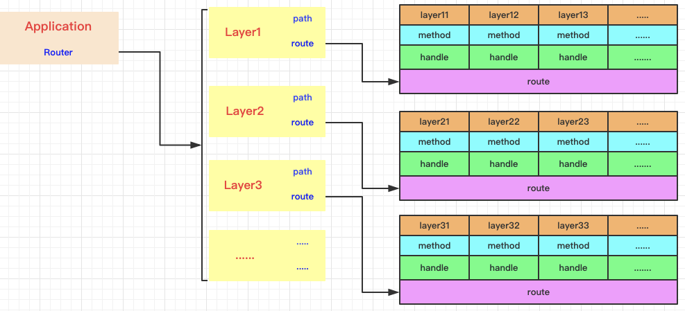
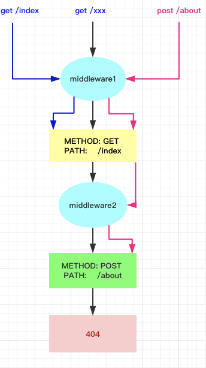
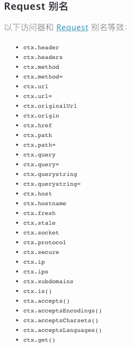
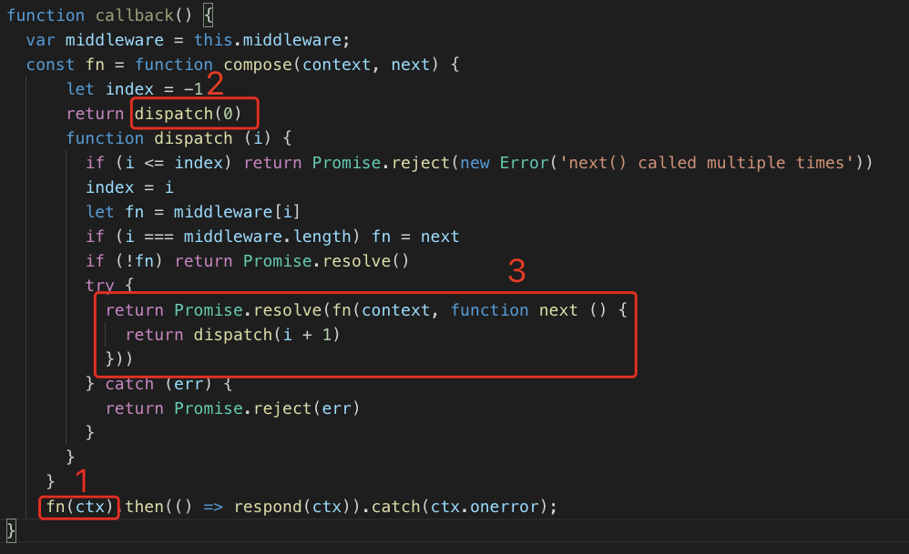
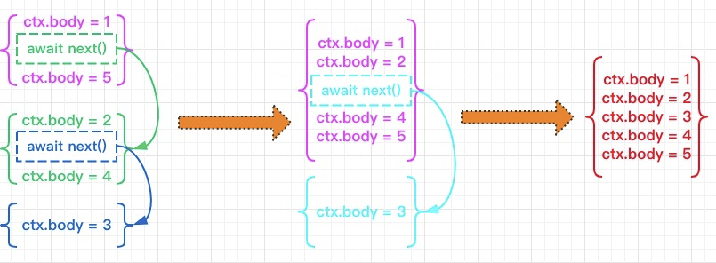
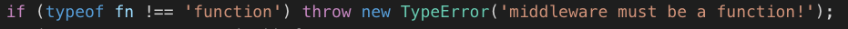
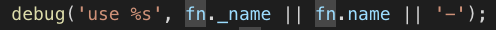
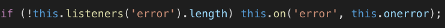
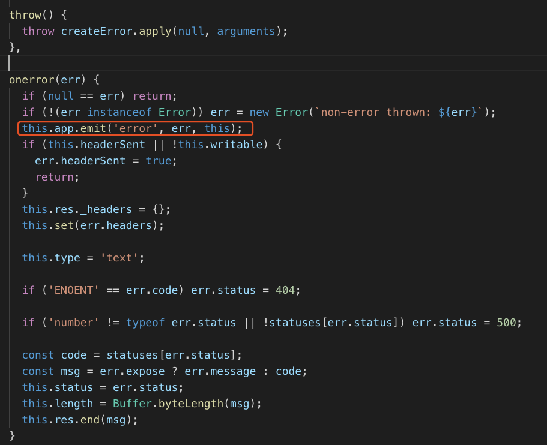
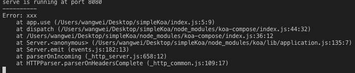

## express和koa2源码对比分析

### 前言

> 随着前端市场的日益壮大，掌握一部分后端知识也成为一个前端开发者不可或缺的部分，幸运的是前端的领域有了自己的后端语言Node.JS,它依赖于Chrome V8引擎，是一个JavaScript运行环境，同时采用事件驱动、非阻塞I/O，轻量、可伸缩、适于实时数据交互应用，单进程，单线程，具有高并发，适合I/O密集型应用等优点。一方面对于前端开发者来说采用JavaScript书写易于上手，另一方面生态活跃，目前拥有80万个npm包。

##### 说起Node.JS不得不提起由设计师出身的TJ大神全权打造的服务器端三大主流框架express、koa以及koa2，对于它们三兄弟我们做一下简单的比较：

<table border="1" style='text-align:left'>
    <tr style='text-align:center'>
        <th style='text-align:center;'>框架名称</th>
        <th style='text-align:center;'>对应语言</th>
        <th style='text-align:center;'>具体</th>
        <th style='text-align:center;'>优点</th>
        <th style='text-align:center;'>缺点</th>
    </tr>
    <tr>
        <td>express</td>
        <td>ES5</td>
        <td>回调嵌套</td>
        <td>自带路由、路由规则及其view，线性逻辑，历史悠久，中间件齐全</td>
        <td>异步地狱回调，对于异常捕获处理不太友好</td>
    </tr>
    <tr>
        <td>koa</td>
        <td>ES6</td>
        <td>Generator函数+yield语句+Promise</td>
        <td>摒弃了callback,采用es6的Generator函数+yield语句+Promise新特性；没有内置任何中间件，框架小而精,自由度高；对stream的支持度很高，并且对错误处理更加友好</td>
        <td>Express的中间件基本不能重用</td>
    </tr>
    <tr>
        <td>koa2</td>
        <td>ES7</td>
        <td>async/await+Promise</td>
        <td>摒弃了callback,采用es7的async/await新特性，代码看起来更加优雅简洁；没有内置任何中间件，框架小而精,自由度高；对stream的支持度很高，并且对错误处理更加友好</td>
        <td>Express的中间件基本不能重用，要求node.js>=7.6.0,不能完全摒弃babel</td>
    </tr>
</table>


##### 今天我们主要是对koa2源码进行分析，koa作为koa2的一个过渡版本，随着es6（2015年6月）到es7（2016年）的发布仅仅几个月的时间，几乎是昙花一现，可能大家还没有来得及做好打算将早期的express项目迁移至koa,koa2已经迫切的与大家见面了，所有对于koa的高不成低不就的处境确实略显尴尬，我们在这里就不予讨论了。

### express源码简要回顾

##### 首先我们看一下express源码的目录结构如下：

           
            |-- express
            '    |-- application.js
            '    |-- express.js
            '    |-- request.js   提供一些方法丰富 request的实例功能
            '    |-- response.js  提供一些方法丰富 response的实例功能
            '    |-- utils.js
            '    |-- view.js      提供模板渲染引擎的封装，通过 res.render() 调用引擎渲染网页
            '    |-- middleware
            '    |   |-- init.js
            '    |   |-- query.js
            '    |-- router       router组件，负责中间件的插入和链式执行
            '        |-- index.js
            '        |-- layer.js
            '        |-- route.js
        

##### express服务启动挂载路由和中间件，我们知道，在express中注册路由和中间件的形式如下：

```
const express = require('express');
const app = express();

app.get('/',(req, res)=>{
    res.send('hello GET')
})
app.post('/getDate', (req, res)=>{
	res.send('getDate POST')
})
app.use('/home', (req, res)=>{
    res.send('home')
})
app.use((res, req, next)=>{
    console.log('----------');
    next()
})
app.get('/about', (req, res)=>{
    res.send('about')
})

app.listen(8080)

```
##### 在源码中我们看到添加路由的方法都是动态生成的,其中的methods实际上是http.METHODS,该属性返回http所有请求的方式构成的数组

```
methods.forEach(function(method){
  app[method] = function(path){
    ·····此处省略一千字·····
    var route = this._router.route(path);
    route[method].apply(route, slice.call(arguments, 1));
     //取出第二个参数，即：处理程序，传入route[method]方法中
    return this;
  };
});
```

##### app.use()用于添加中间件，其中根据有无路径参数分为路由级中间件和应用级中间件,对于路由级中间件默认为get请求，并且所有中间件下面的route属性值都为undefined

```
proto.use = function(fn) {
	var path = '/';

	//路径挂载
	if(typeof fn !== 'function') {
		path = fn;
		fn = arguments[1];
	}

	var layer = new Layer(path, fn);
	layer.route = undefined;

	this.stack.push(layer);

	return this;
};
```

##### 估计大家在此刻也不知道具体在挂载路由和中间件的时候都干了些啥东西，首页我们应该知道客户端发送一个请求我们要确定该执行哪个回调，我们可以通过请求的```path```和```method```去确定对应的回调函数

**普通思路** 我们在```app.get()```、```app.post()```、```app.delete()```等方法时候可以把所有路由信息收集起来,然后通过遍历stack匹配到对应的```path+method```然后去执行对应的```fn```,但是明显当路由比较多的时候遍历起来性能明显很受影响
```
function Router(){
    this.stack = []
}
Router.prototype[method] = function(path, fn){
    this.stack.push({path, method, fn})
}
```

**express思路** 封装了```layer```层和```route```层,每一个```layer```层对应一个路径，```layer```下面的```stack```存放```Route```,所以对应的```Route```存放的才是路由详情
```
function Router(){
    this.stack = []
}
Router.prototype[method] = function(path, fn){
    var route = new Route(path);
    var layer = new Layer(path, route.dispatch.bind(route));
    layer.route = route;
    this.stack.push(layer);
}

function Layer(path, fn){
    this.handle = fn;
    this.stack = [];
    this.name = fn.name || '<anonymous>';
    this.path = undefined;
}

function Route(path){
    this.path = path;
    this.methods = {};
}
Route.prototype.dispatch = function(res, req, done){}
```

##### 针对上面的思路，路由层级应该是这样子的,首先去查找路径，在找到对应的```layer```层，在根据请求方式方式找到对应的```handle```执行


##### 但是事实并非如此，一方面该结构很有可能会丢失路由顺序这个属性，对于中间件的执行顺序将不可控制

```
app.put('/', function(req, res) {
    res.send('put Hello World!');
});
app.use((req, res, next)=>{
   console.log('中间件');
   next();
});
app.get('/', function(req, res) {
    res.send('get Hello World!');
});
```

##### 另一方面因为在express框架中，Route存储的是真正的路由信息，可以当做单独的成员使用

```
const express = require('express');
const app = express();
const router = express.Router();

router.use((req, res, next)=>{
    console.log(req.method, req.url);
    next();
})
router.use('/bar', (req, res, next)=>{
    //干一些事情
    next()
})
app.use('/foo', router);

app.listen(8080)
```

##### 其实在express中的路由中对应关系如下图



##### 最终路由和中间件都存储在```Router```中的```stack```中如下图所示：


##### 当一个请求进入的时候,进行了如下操作（伪代码）：

```
ApplicationCache.prototype.handle = function(req, res){
    if(!res.send){'....'}//添加res.send方法
    function done(){'....'}//处理错误的方法
    this.router.handle(req, res, done);//调用router的方法
}

Router.prototype.handle = function(req, res, done){
    let idx = 0, stack = this.stack, method = req.method;

    function next(err){
       var layerError = (err === 'route' ? null : err); 
       if(idx >= stack.length){ return done(layerError)};//超出最大，调用done
       var path = req.url;
       var layer = stack[idx++];
       if(layer.match(path)){
           if(!layer.route){//处理中间件
              if(layerError){
                  layer.handle_error(layerError, req, res, next);
              }else{
                  layer.handle_request(req, res, next);
              }
           }else if(layer.route._handles_method(method)){//处理路由
               layer.handle_request(req, res, next);
           }
       }else{
           layer.handle_error(layerError, req, res, next);
       }
    }

    next();
}

Layer.prototype.match = function(path){
    if(this.fast_star){return true}//快速匹配通配符’*‘
    //如果是普通路由，从后匹配
    if(this.route && this.path === path.slice(-this.path.length)) {
        return true;
    }
    if (!this.route) {
        //不带路径的中间件
        if (this.path === '/') {
          this.path = '';
          return true;
        }
    
        //带路径中间件
        if(this.path === path.slice(0, this.path.length)) {
          return true;
        }
      }
    
      return false;
}

Layer.prototype.handle_error = function(error, req, res, next){
    var fn = this.handle;
    try{
        fn(error, req, res, next)
    } catch(err){
        next(err)
    }
}

Layer.prototype.handle_request = function(req, res, next){
    var fn = this.handle;
    try{
        fn(req, res, next)
    } catch(err){
        next(err)
    }
}

Route.prototype._handles_method = function(method){
    return !!this.methods[name]
}
```

##### 可以看出其实express通过next的栈式迭代，遍历stack中的路由及其中间件，按照顺序去执行，就像这样

```
const arr = [
    function f1(req, res, next){
        console.log(1);
        next();
        console.log(2);
    },
    function f2(req, res, next){
        console.log(3);
        next();
        console.log(4)
    },
    function f3(req, res, next){
        console.log(5)
    }
]

idx = 0;
function next(){
 
  if(idx > arr.length){return}
  var fn = arr[idx++];
  fn(1, 2, next)
}

next()
```
##### 如果对上面的栈式迭代还不太懂，没关系，我们在接下来的koa2源码分析中会详细讨论的。

##### 其实我们发现express中间件执行也是一种由上游到下游再返回上游的洋葱头模型，实验证明下：

```
const express = require('express');
const app = express();

app.use((req, res, next)=>{
    console.log(1);
    next();
    console.log(5)
})
app.use((req, res, next)=>{
    console.log(2);
    next();
    console.log(4)
})
app.use((req, res, next)=>{
    console.log(3);
    next();
})
app.listen(8080)
//打印结果： 1 2 3 4 5
```

##### 但是express的中间件并没有在next后面再执行一些东西, 而是像这样：

```
function middleware(req, res, next){
    //做一些事情
    next()
}
```

##### 采用线性方式对该请求匹配到对应的路由之前的中间件挨个执行，一直到碰到对应的路由回调回应后回流上去

```
const express = require('express');
const app = express();

app.use((req, res, next)=>{
    console.log(1);
    next();
    console.log(5)
})
app.use((req, res, next)=>{
    console.log(2);
    next();
    console.log(4)
})
app.get('/m', (req, res)=>{
    res.send = 'hello world';
})
app.use((req, res, next)=>{
    console.log(3);
    next();
})
app.listen(8080)
```

##### 对于这段代码，我们启动服务访问一个不存在的路由发现打印出1，2，3，4，5也就是面对空路由express需要遍历所有stack，到最后遍历完没有发现对应路由进行done处理回应错误，当调用/m路由，执行顺序为：

打印 ： 1 2

回应：res.send = 'hello world'

打印： 4 5 

##### 所以，express虽然是线性处理中间件，其实他的执行也是洋葱头模型，只是中间件的写法使他执行的时候让他给人的错觉是线性的



##### 其实从上面我们可以看出expres有以下缺点：

**当路由及其中间件太多的情况下需要大量的遍历，开销比较大**
**在错误处理方面不是那么的理想，对于打印日志没有统一的错误出口，必须在代码里面对错误进行自行处理**
**后端回调函数为普通函数，编写函数体时避免不了大量的地狱式回调嵌套**

### koa2源码分析

#### 目录总体概述

##### koa2的源码工程目录如下：

    |-- koa
    |-- History.md
    |-- LICENSE
    |-- Readme.md
    |-- directoryList.md
    |-- package.json
    |-- lib
        |-- application.js
        |-- context.js
        |-- request.js
        |-- response.js
 
##### 我们可以看到koa2源码只有四个文件，非常的干练简洁，接下来我们进行一个详细的分析：

#### 初始化一个koa实例究竟做了些啥呢？？？

```
const koa = require('koa');
const app = koa();
```

##### 首先，Application继承了node原生包```events```

```
class Application extends Emitter {}
```

##### 然后在constructor中初始化了一些变量

```
 constructor() {
    super();

    this.proxy = false;//是否代理
    this.middleware = [];//用于中间件储存的数组
    this.subdomainOffset = 2;
    this.env = process.env.NODE_ENV || 'development';//环境
    this.context = Object.create(context);
    this.request = Object.create(request);
    this.response = Object.create(response);
    if (util.inspect.custom) {
      this[util.inspect.custom] = this.inspect;
    }
  }
```

##### 最后定义了一些方法

```
 listen(){}
 toJSON(){}
 inspect(){}
 use(){}
 callback(){}
 handleRequest(){}
 createContext(){}
 onerror(){}
```

##### 我们可以看一下```this.context.__proto__= context```;其中context引用自context.js文件,context.js文件内容如下：

```
context = {
    insepct(){},
    toJSON(){},
    throw(){},
    onerror(){},
    get cookies(){},
    set cookies(){},
}
delegate(proto, 'response').method('...').access('...').getter('...');
delegate(proto, 'request').method('...').access('...').getter('...');
```
##### 主要定义了一些方法，并且采用delegate将request和response的一些方法和属性直接委托到context上面,例如平时像这样的用法：

 

##### 同时重写了cookies属性的set和get方法

##### ```this.request.__proto__ = request```以及```this.response.__proto__ = response```分别将request.js文件和response.js文件内容进行了继承其中request.js和response.js分别对http的request和response的一些方法和属性做了重写和处理

##### 据上所述，初始化实例的时候主要做了一下几件事：

**1.koa继承了events**

**2.定义了一些方法和属性**

**3.重写部分request和response方法并对部分属性处理**

**4.将request和response的部分方法和属性委托到context上面**

**5.继承context,request,response**

#### app.use()都做了些啥事呢？？？

```
use(fn) {
    if (typeof fn !== 'function') throw new TypeError('middleware must be a function!');
    if (isGeneratorFunction(fn)) {
      deprecate('Support for generators will be removed in v3. ' +
                'See the documentation for examples of how to convert old middleware ' +
                'https://github.com/koajs/koa/blob/master/docs/migration.md');
      fn = convert(fn);
    }
    debug('use %s', fn._name || fn.name || '-');
    this.middleware.push(fn);
    return this;
  }
```

##### 很简单的函数，就是将所有的async函数全部收集到middleware里面，同时对Generator函数也做了处理


####  app.listen(port, callback)做了什么呢？？？

```
  listen() {
    debug('listen');
    const server = http.createServer(this.callback());
    return server.listen.apply(server, arguments);
  }
```
##### 此刻启动服务并将this.callback的执行结果传入服务中

```
  callback() {
    const fn = compose(this.middleware);

    if (!this.listeners('error').length) this.on('error', this.onerror);

    return (req, res) => {
      res.statusCode = 404;
      const ctx = this.createContext(req, res);
      onFinished(res, ctx.onerror);
      fn(ctx).then(() => respond(ctx)).catch(ctx.onerror);
    };
  }
```
##### 其中的第一行代码中的 compose()专门被封装在compose.js中，这个文件很简单只有一个函数

```
function compose (middleware) {
  if (!Array.isArray(middleware)) throw new TypeError('Middleware stack must be an array!')
  for (const fn of middleware) {
    if (typeof fn !== 'function') throw new TypeError('Middleware must be composed of functions!')
  }

  /**
   * @param {Object} context
   * @return {Promise}
   * @api public
   */

  return function (context, next) {
    // last called middleware #
    let index = -1
    return dispatch(0)
    function dispatch (i) {
      if (i <= index) return Promise.reject(new Error('next() called multiple times'))
      index = i
      let fn = middleware[i]
      if (i === middleware.length) fn = next
      if (!fn) return Promise.resolve()
      try {
        return Promise.resolve(fn(context, function next () {
          return dispatch(i + 1)
        }))
      } catch (err) {
        return Promise.reject(err)
      }
    }
  }
}

```

##### 抛去前面的错误处理，callback函数如下：

```

  function callback() {
    var middleware = this.middleware;
    const fn = function compose(context, next) {
        let index = -1
        return dispatch(0)
        function dispatch (i) {
          if (i <= index) return Promise.reject(new Error('next() called multiple times'))
          index = i
          let fn = middleware[i]
          if (i === middleware.length) fn = next
          if (!fn) return Promise.resolve()
          try {
            return Promise.resolve(fn(context, function next () {
              return dispatch(i + 1)
            }))
          } catch (err) {
            return Promise.reject(err)
          }
        }
      }

    if (!this.listeners('error').length) this.on('error', this.onerror);

    return (req, res) => {
      res.statusCode = 404;
      const ctx = this.createContext(req, res);
      onFinished(res, ctx.onerror);
      fn(ctx).then(() => respond(ctx)).catch(ctx.onerror);
    };
  }
```

#### 当有请求发生的时候koa2做了些啥呢？？？

```
  (req, res) => {
      res.statusCode = 404;
      const ctx = this.createContext(req, res);
      onFinished(res, ctx.onerror);
      fn(ctx).then(() => respond(ctx)).catch(ctx.onerror);
    };
```

##### 其中的```ctx = this.createContext(req, res);```将req和res挂载到ctx上面，并且在ctx上面挂载了一些方法并返回ctx

```
createContext(req, res) {
    const context = Object.create(this.context);
    const request = context.request = Object.create(this.request);
    const response = context.response = Object.create(this.response);
    context.app = request.app = response.app = this;
    context.req = request.req = response.req = req;
    context.res = request.res = response.res = res;
    request.ctx = response.ctx = context;
    request.response = response;
    response.request = request;
    context.onerror = context.onerror.bind(context);
    context.originalUrl = request.originalUrl = req.url;
    context.cookies = new Cookies(req, res, {
      keys: this.keys,
      secure: request.secure
    });
    context.accept = request.accept = accepts(req);
    context.state = {};
    return context;
  }
```

##### 接下来的```onFinished(res, ctx.onerror);```其实就是当一个请求结束、完成或者发生错误时候执行回调ctx.onerror

##### 接下来对于最重要的部分，整合如下：



##### 我们发现他跟express一样是一个栈式的后进先出的递归迭代函数，遇到next()就会递归调用下一个中间件，不同的是express都是同步调用，但是koa2都是async/await，其中fn返回promise，需要回应的内容都赋值到ctx.response上面

##### 例如下面的例子执行如图所示：

```
const koa = require('koa');
const app = new koa();

app.use(async(ctx, next)=>{
    ctx.body = `<span>1号→</span>`;
    await next();
    ctx.body += `<span>5号</span>`;
})
//2号
app.use(async(ctx, next)=>{
    ctx.body += `<span>2号→</span>`;
    await next();
    ctx.body += `<span>4号→</span>`;
})
//3号
app.use(async(ctx, next)=>{
    ctx.body += `<span>3号→</span>`;
})
app.listen(8080, ()=>{
    console.log('serve is running at port 8080...')
})
```




##### 祭出官网著名的洋葱头模型，一层层从外部进入最里面再一层层出来，也就是一个从上游到下游，再从下游回流到上游的过程

  


##### 最后将回应的内容赋值到ctx.res上以promise返出并调用response(ctx)

```
function respond(ctx) {
  // allow bypassing koa
  if (false === ctx.respond) return;

  const res = ctx.res;
  if (!ctx.writable) return;

  let body = ctx.body;
  const code = ctx.status;

  // ignore body
  if (statuses.empty[code]) {
    // strip headers
    ctx.body = null;
    return res.end();
  }

  if ('HEAD' == ctx.method) {
    if (!res.headersSent && isJSON(body)) {
      ctx.length = Buffer.byteLength(JSON.stringify(body));
    }
    return res.end();
  }

  // status body
  if (null == body) {
    body = ctx.message || String(code);
    if (!res.headersSent) {
      ctx.type = 'text';
      ctx.length = Buffer.byteLength(body);
    }
    return res.end(body);
  }

  // responses
  if (Buffer.isBuffer(body)) return res.end(body);
  if ('string' == typeof body) return res.end(body);
  if (body instanceof Stream) return body.pipe(res);

  // body: json
  body = JSON.stringify(body);
  if (!res.headersSent) {
    ctx.length = Buffer.byteLength(body);
  }
  res.end(body);
}

```

##### 我们看到koa2可以回应题可以是null,Buffer,Json,stream等，均是借助三方node包， 非常的简洁

#### 让我们看一下koa2的错误处理机制？？？

  
  
  
  
 

##### 我们可以看到其实在刚开始Application继承了node.js原生包```events```,一部分采用Promise的catch的捕获直接被抛出打印到后端，也可以通过events的广播机制直接发送，这对于我们打印日志极度的方便，我们只需要监听error事件，接受传入的错误并储存

```
class Application extends Emitter {}
```

```
const koa = require('koa');
const app = new koa();

app.use((ctx, next)=>{
  throw new Error('xxx');
});
app.on('error',(err)=>{
    console.log('----------')
    console.log(err)
});
app.listen(8080, ()=>{
    console.log('serve is running at port 8080')
})
```



##### 为了进一步熟悉koa2中间件机制，我们不妨拿一个中间件来分析

### koa中间件koa-static分析

```
const Koa = require('koa');
const app = new Koa();
app.use(require('koa-static')(root, opts));
```
##### koa-static源码非常简单，只是一个单纯的函数


##### 第一个参数是静态文件的根目录，第二个参数是一个配置[具体看koa-static文档](https://www.npmjs.com/package/koa-static)

##### 根据链接在静态目录中查找对应的静态文件并借助koa-send包回应到前台

### 总结

##### 通过上述源码分析对比，我们发现koa2和express都是采用栈式迭代，也就是所谓的洋葱头模式，不同的是koa2的中间件书写逻辑完全采用这种回流机制next()前后均做了一些事情，而express采用的next线性迭代，无可厚非，当路由中间件数目增多的时候都无可厚非的会加长迭代时间，koa2回流机制显的更加明显，摒弃其缺点不说，koa2的框架简洁大气，给了开发者更加开阔的灵活的编程方式，尤其在错误处理和回应各种数据类型方面显的更加人性化，但是express自带路由系统和模板引擎系统，开发更加简便。但是随着ES6、ES7的相继发布，koa2无可厚非成了后期开发的不二选择，当然，萝卜白菜各有所爱，各位大佬根据自己的项目来选择吧！！！