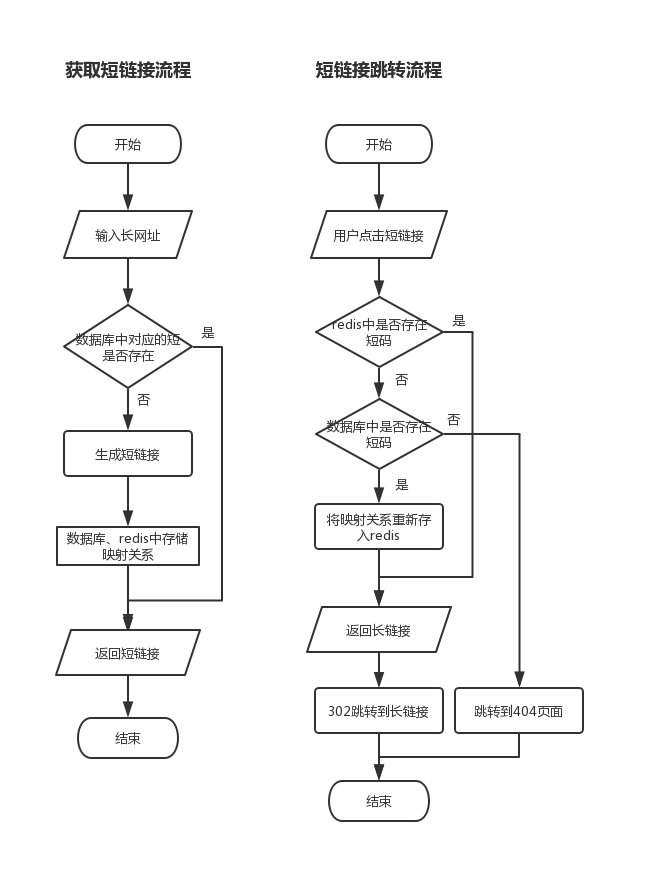

# 教你怎么实现缩短网址功能

> 本文将简单介绍，如何去完成一个缩短网址的功能。
> Node.js + MySQL + Redis版本的源码地址：[github](https://github.com/liucong1/shortLink)
> Demo地址：[http://www.ecool.fun/shortLink](http://www.ecool.fun/shortLink)

文章阅读大概需要5分钟。

## 什么是短链接

短链接，通俗来说，就是将长的URL网址，通过程序计算等方式，转换为简短的网址字符串。

大家经常可以从微博或者各类营销短信中，看到短链接，形式一般类似于 `t.cn/xxxxxx`，点击后，就能跳转到对应的页面。

早期短链接广泛应用于图片上传网站，通过缩短网址URL链接字数，达到减少代码字符串的目的。更便于使用者引用网址，写入代码中，节省字符数空间。常见于网店图片分类的使用，因有字符限制，运用短链接，达到外链图片的目的，自微博盛行以来，在微博字数有限的特色下，短链接也盛行于微博网站，以节省字数，给博主发布更多文字的空间。

将长链接转成短链接，一般是为了方便记忆或者传播。


## 需要完成的功能

从上面的介绍中，我们得出，缩短网址需要完成以下两个功能点：

- 将长网址缩短成短链接
- 点击生成短链接，能正常跳转到原来的长网址页面


## 全流程设计

其实上述功能点的原理很简单，简单描述一下：

- 用户输入长网址，服务端接收后进行处理，并根据长网址的内容，生成一个短码，并将映射关系进行存储。然后根据短码拼接出短链接，返回给用户；
- 用户点击短链接，服务器端根据短链接中的短码，查找到对应的长网址，并302跳转到对应的页面。


知识点：为什么要使用302跳转，而不是301跳转呢？

> 301是永久重定向，302是临时重定向。短地址一经生成就不会变化，所以用301是符合http语义的。但是如果用了301， Google，百度等搜索引擎，搜索的时候会直接展示真实地址，那我们就无法统计到短地址被点击的次数了，也无法收集用户的Cookie, User Agent 等信息，这些信息可以用来做很多有意思的大数据分析，也是短网址服务商的主要盈利来源。
> 引自知乎-武林的回答，[原文链接](https://www.zhihu.com/question/20103344/answer/573638467)


整个流程的设计如下图所示：



可以看到，我用到了`MySQL`和`Redis`来存储长网址和短码之间的映射关系。

用`MySQL`想必大家都能理解，但是为什么要用 `Redis` 呢，直接用数据库不就好了吗？

这个主要是考虑到生成短链接，在投放之后的访问量会比较大，使用 `Redis` 缓存后，能有效降低数据库的压力。


## 生成短码的方法

通过上面的全流程设计，会发现主要的问题就是如何通过长网址，去生成对应的短码。

短码一般是由 `[a - z, A - Z, 0 - 9]` 这62 个字母或数字组成，短码的长度也可以自定义，但一般不超过8位。比较常用的都是6位，6位的短码已经能有568亿种的组合：(26+26+10)^6 = 56800235584，已满足绝大多数的使用场景。

目前比较流行的生成短码方法有：`自增id`、`摘要算法`、`普通随机数`。

- 自增id

该方法是一种无碰撞的方法，原理是，每新增一个短码，就在上次添加的短码id基础上加1，然后将这个10进制的id值，转化成一个62进制的字符串。

一般利用数据表中的自增id来完成：每次先查询数据表中的自增id最大值max，那么需要插入的长网址对应自增id值就是 max+1，将max+1转成62进制即可得到短码。

但是短码 id 是从一位长度开始递增，短码的长度不固定，不过可以用 id 从指定的数字开始递增的方式来处理，确保所有的短码长度都一致。同时，生成的短码是有序的，可能会有安全的问题，可以将生成的短码id，结合长网址等其他关键字，进行md5运算生成最后的短码。

10进制转成62进制的具体实现：

```javascript
function string10to62(number) {
    const chars = '0123456789abcdefghigklmnopqrstuvwxyzABCDEFGHIGKLMNOPQRSTUVWXYZ';
    const charsArr = chars.split('');
    const radix = chars.length;
    let qutient = +number;
    let arr = [];
    do{
        let mod = qutient % radix;
        qutient = (qutient - mod) / radix;
        arr.unshift(charsArr[mod]);
    }while(qutient);
    return arr.join('');
}
```


- 摘要算法

摘要算法又称哈希算法，它表示输入任意长度的数据，输出固定长度的数据。相同的输入数据始终得到相同的输出，不同的输入数据尽量得到不同的输出。

算法思路：

1、将长网址通过 `md5` 运算，生成 32 字符的 hex string，分为 4 段，每段 8 个字符；

2、对这四段循环处理，取 8 个字节，将其看成 16 进制串，并与 0x3fffffff(30位1) 与操作，即超过 30 位的忽略处理；

3、这 30 位分成 6 段，每 5 位的数字作为字母表的索引取得特定字符，依次进行获得 6 位字符串。

4、总的 `md5` 串可以获得 4 个 6 位串，取里面的任意一个就可作为这个长网址的短链接 url 地址。

虽然几率很小，但是该方法依然存在碰撞的可能性，解决冲突会比较麻烦。不过该方法生成的短码位数，是固定的，也不存在连续生成的短码有序的情况。


- 普通随机数

该方法是从62个字符串中随机取出一个6位短码的组合，然后去数据库中查询该短码是否已存在。如果已存在，就继续循环该方法重新获取短码，否则就直接返回。

该方法是最简单的一种实现，不过由于`Math.round()`方法生成的随机数属于伪随机数，碰撞的可能性也不小。在数据比较多的情况下，可能会循环很多次，才能生成一个不冲突的短码。

具体实现：

```
// 获取唯一的Link
async getShortLink() {
    const shortLink = this.generateShortLink();

    // 查询数据库中是否存在该链接，如果存在，就直接返回
    const searchResult = await this.searchByLinkInMySQL(shortLink);

    if (searchResult && searchResult.length > 0) {
    // 如果shortLink已经存在，就遍历重新生成
        return this.getShortLink();
    }
    return shortLink;

}

// 生成随机的Link
generateShortLink() {
    let str = '';
    const arr = [
        '0', '1', '2', '3', '4', '5', '6', '7', '8', '9',
        'a', 'b', 'c', 'd', 'e', 'f', 'g', 'h', 'i', 'j', 'k', 'l', 'm', 'n', 'o', 'p', 'q', 'r', 's', 't', 'u', 'v', 'w', 'x', 'y', 'z',
        'A', 'B', 'C', 'D', 'E', 'F', 'G', 'H', 'I', 'J', 'K', 'L', 'M', 'N', 'O', 'P', 'Q', 'R', 'S', 'T', 'U', 'V', 'W', 'X', 'Y', 'Z',
    ];

    for (let i = 0; i < 6; i++) {
        const pos = Math.round(Math.random() * (arr.length - 1));
        str += arr[pos];
    }
    return str;
}
```

综上，比较推荐使用第一种方法来实现短码的生成。

## 广告时间

最后，欢迎大家star我们的[人人贷大前端团队博客](https://github.com/rrd-fe/blog)，所有的文章还会同步更新到[知乎专栏](https://www.zhihu.com/people/ren-ren-dai-da-qian-duan-ji-zhu-zhong-xin/activities) 和 [掘金账号](https://juejin.im/user/5cb690b851882532941dd5d9)，我们每周都会分享几篇高质量的大前端技术文章。


## 参考文章

- [短网址(short URL)系统的原理及其实现](https://segmentfault.com/a/1190000012088345)

- [短链接系统的算法原理](https://www.cnblogs.com/feiyafeiblog/p/8581853.html)

- [短链接、短网址使用的是什么算法？ - 武林的回答 - 知乎](https://www.zhihu.com/question/20103344/answer/573638467)


