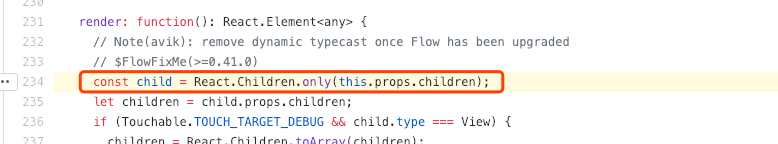

# React Native 的Touchable组件

RN 官方提供了Touchable系列四个组件，作为按钮响应用户的点击时间，分别如下：

* TouchableWithoutFeedback： 只响应点击事件，但没有任何点击反馈
* TouchableHighlight： 响应点击事件，并且手指按下时可以设置一个背景颜色
* TouchableOpacity ： 响应点击事件，并且手指按下时可以设置透明度
* TouchableNativeFeedback ： 响应点击事件，手指按下时有波浪效果（仅Android平台）

### TouchableWithoutFeedback

* Touchable系列都只接受一个子组件，如果有多个组件需要响应事件，需要用View包起来。我们从源码[这里](https://github.com/facebook/react-native/blob/master/Libraries/Components/Touchable/TouchableWithoutFeedback.js#L234)也可以看到,会检查是否只包含有一个组件。

* 因为点击之后没有任何交互反馈，一般不推荐使用。例如登陆页或者文本输入页希望点击空白的时候收齐键盘，可以将整体包进 TouchableWithoutFeedback 

* TouchableWithoutFeedback 组件不支持style属性，我们不能控制它的样式。

参考[Demo](https://snack.expo.io/@wangcheng714/touchablebuttonexample)可以看到只有TouchableWithoutFeedback无法设置样式

具体可以参考[这个issue](https://github.com/facebook/react-native/issues/18257)

我们从[源码实现](https://github.com/facebook/react-native/blob/master/Libraries/Components/Touchable/TouchableWithoutFeedback.js#L231-L264)中也可以看到，TouchableWithoutFeedback 直接将onPress、onLongPress等各种交互时间绑定到了子组件上，如果需要控制样式给子组件添加即可

### TouchableHighlight

* TouchableHighlight 是在 TouchableWithoutFeedback 基础上进行了封装 添加了交互扩展，

从[源码中可以看到](https://github.com/facebook/react-native/blob/master/Libraries/Components/Touchable/TouchableHighlight.js#L395-L453)其实就是在TouchableWithoutFeedback 外层添加了一个View，当手指按下时可以设置一个颜色，参考上面Demo当手指按下时设置为 yellow。 其实手指按下的的颜色就是通过改变这个View的颜色来实现的， 同样因为有了最外层的View我们就可以给 TouchableHighlight 组件设置Style属性控制它的样式。

### TouchableOpacity

* 和 TouchableHighlight 类似，都是在 TouchableWithoutFeedback 基础上进行的封装。 TouchableOpacity 是通过设置手指按下时的透明度来给用户反馈。

### TouchableNativeFeedback （仅Android平台）

* TouchableNativeFeedback 是在 TouchableWithoutFeedback 基础上增加了手指按下时的波浪效果，和Android原生效果类似。

* 从[源码可以看到](https://github.com/facebook/react-native/blob/master/Libraries/Components/Touchable/TouchableNativeFeedback.android.js#L319) 直接返回了child，并没有在外层封装View，所以和 TouchableWithoutFeedback 一样 不能通过设置 style控制样式。

## 参考文档

* https://facebook.github.io/react-native/docs/improvingux#use-android-ripple