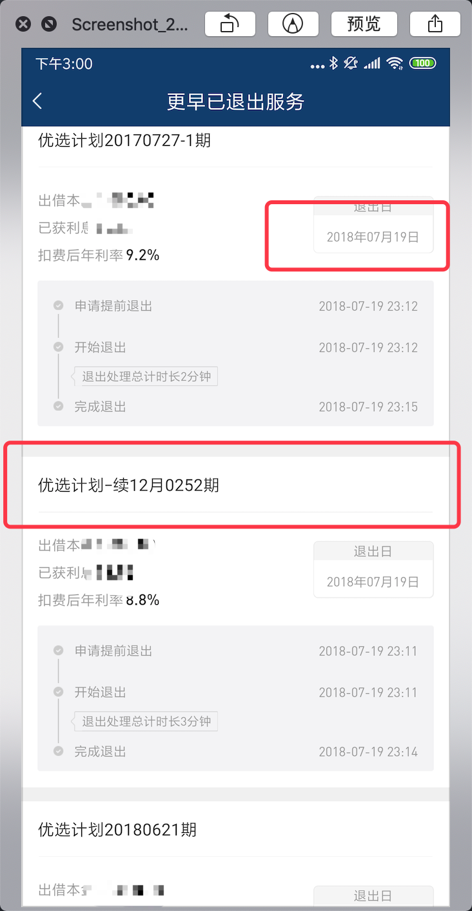
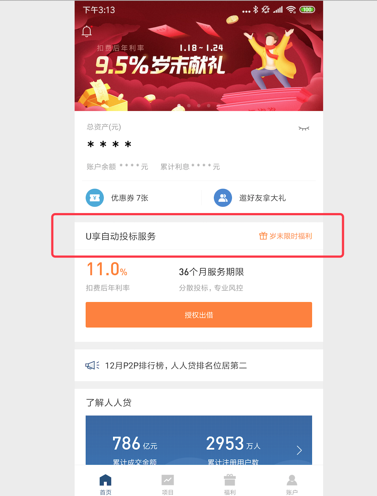
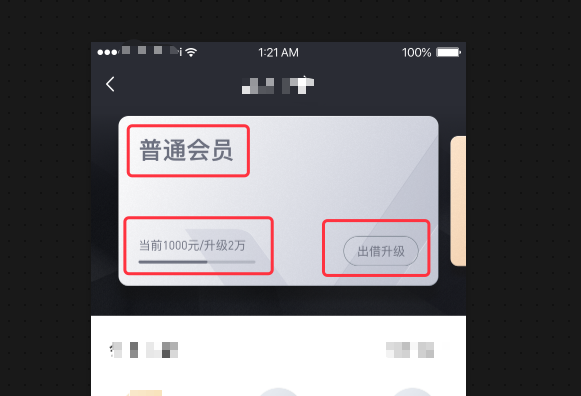

# React Native 常见UI代码实现

为了统一编码习惯，增强 `React Native`代码可维护性，收集一些常见的UI样式，统一提供实现方案。

## 一些约定

* `style`应该尽量写在外面；使用 `inline style` 时最多包含2个样式
* `DOM` 树里 **不使用** 三元运算符生成 `DOM`
* `page` 尽量拆分组件，避免 `render` 太大，减少冗余的 `DOM` 层级
* 优先使用 `Functional Component` 和 `PureComponent`

## Text 常见样式

相关链接:

* [https://snack.expo.io/@sophister/text-code-snippet](https://snack.expo.io/@sophister/text-code-snippet)
* [nested Text vertical align not working](https://stackoverflow.com/a/50469114/2583885)

1. 单行文字垂直居中



经常会有单行文字垂直居中的需求，文字全部同一种样式，**不存在嵌套**，基本上，默认给 `Text` 设置 `lineHeight` 即可，比如这样：

```javascript
const style = {
    lineHeight: 40,
    fontSize: 16,
};
<Text style={style}>some single line text to vertical align</Text>
```

如果遇到在 `Android` 下，文字顶部间距过大，可以使用 `View` 来嵌套 `Text` 去除掉顶部间距，像这样：

```javascript
const styles = {
    wrap: {
        height: 40,
        flexDirection: 'column',
        justifyContent: 'center',
    },
    text: {
        fontSize: 16,
        includeFontPadding: false,
        textAlignVertical: 'center',
    }
};
<View style={styles.wrap}>
    <Text style={styles.text}>some single line text to vertical align</Text>
</View>
```

2. 不同样式的文字，单行内垂直居中



上面这种效果，经常能见到(先不考虑图标，只考虑文字的情况)，尝试了 `Text` 嵌套来实现垂直居中，但是效果不甚理想，需要用上 `View` 包含各个 `Text` 来实现：

```javascript
const style2 = {
    wrap: {
    height: 40,
    flexDirection: 'row',
    alignItems: 'center',
    paddingHorizontal: 15,
    justifyContent: 'space-between',
    borderBottomWidth: 1,
    borderBottomColor: '#ccc',
    backgroundColor: '#fff',
  },
  main: {
    fontSize: 16,
    color: '#000',
  },
  sub: {
    fontSize: 12,
    color: 'orange',
  }
};
<View style={style2.wrap}>
    <Text style={style2.main}>U享自动投标服务</Text>
    <Text style={style2.sub}>岁末限时福利</Text>
</View>
```

如果要考虑右侧的小 icon，实现也简单直接，右侧用 `View` 包起来，作为一个整体来和左侧文字布局：

```javascript
const style3 = {
  wrap: {
    height: 40,
    flexDirection: 'row',
    alignItems: 'center',
    paddingHorizontal: 15,
    justifyContent: 'space-between',
    borderBottomWidth: 1,
    borderBottomColor: '#ccc',
    backgroundColor: '#fff',
  },
  main: {
    fontSize: 16,
    color: '#000',
  },
  right: {
    alignSelf: 'stretch',
    flexDirection: 'row',
    alignItems: 'center',
  },
  icon: {
    width: 16,
    height: 16,
  },
  sub: {
    fontSize: 12,
    color: 'orange',
    marginLeft: 3,
  }
};
<View style={style3.wrap}>
    <Text style={style3.main}>U享自动投标服务</Text>
    <View style={style3.right}>
        <Image style={style3.icon} source={{uri: 'https://m.we.com/cms/5864b392e0286a10854d8766/dev/loginRedPacket@2x.png'}}></Image>
        <Text style={style3.sub}>岁末限时福利</Text>
    </View>
</View>
```

3. 文字固定在图片某个位置



有些情况下下，文字需要固定在图片的某个位置，常见的，在轮播图的情况下，每个图片底部，可能会显示一些相关的文字信息。通常在涉及到图片的情况下，应该需要保证图片在各个屏幕尺寸，都能保持原始的图片宽高比例，因此，在有图片的情况下，经常会使用 **按屏幕宽度等比缩放** 来设置图片相关尺寸。在实现上述这种效果的时候，全部采用的是 **根据当前屏幕宽度，等比的缩放各种大小、尺寸**，代码如下：

```javascript
//文字固定在图片上的样式
const style4 = {
  header: {
    height: scalePx2dp(420),
    paddingTop: scalePx2dp(20),
    overflow: 'hidden',
  },
  headerBg: {
    position: 'absolute',
    left: 0,
    top: 0,
    width: '100%',
    aspectRatio: 1080 / 681,
  },
  item: {
    width: scalePx2dp(640),
    height: scalePx2dp(340),
    alignSelf: 'center',
  },
  image: {
    position: 'absolute',
    left: 0,
    top: 0,
    width: scalePx2dp(668),
    height: scalePx2dp(380),
  },
  title: {
    position: 'absolute',
    fontSize: scalePx2dp(48),
    lineHeight: scalePx2dp(67),
    left: scalePx2dp(40),
    top: scalePx2dp(34),
    color: '#6c7080',
    fontFamily: 'PingFangSC-Semibold',
  },
  stepCon: {
    position: 'absolute',
    left: scalePx2dp(40),
    bottom: scalePx2dp(45),
  },
  stepDesc: {
    fontSize: scalePx2dp(24),
    lineHeight: scalePx2dp(33),
    color: '#6c7080',
    fontFamily: 'PingFangSC-Regular',
  },
  progress: {
    width: scalePx2dp(234),
    height: scalePx2dp(6),
    borderRadius: scalePx2dp(4.5),
    overflow: 'hidden',
    marginTop: scalePx2dp(14),
    backgroundColor: 'rgba(108,112,128, .3)'
  },
  progressInner: {
    position: 'absolute',
    top: 0,
    left: 0,
    height: '100%',
    width: '69%',
    backgroundColor: '#6c7080',
  },
  btn: {
    position: 'absolute',
    width: scalePx2dp(150),
    height: scalePx2dp(60),
    lineHeight: scalePx2dp(60),
    right: scalePx2dp(40),
    bottom: scalePx2dp(40),
    textAlign: 'center',
    borderRadius: scalePx2dp(30),
    borderWidth: 1,
    borderColor: '#6c7680',
    color: '#6c7080',
  }
};
<View style={style4.header}>
    <Image style={style4.headerBg} source={{uri: 'https://s0.renrendai.com/cms/5864b392e0286a10854d8766/dev/bg@2x.png'}}></Image>
    <View style={style4.item}>
        <Image style={style4.image} source={{uri: 'https://m.we.com/cms/5864b392e0286a10854d8766/dev/card.png'}}></Image>
        <Text style={style4.title}>普通会员</Text>
        <View style={style4.stepCon}>
            <Text style={style4.stepDesc}>当前1000元/升级2万</Text>
            <View style={style4.progress}>
                <View style={style4.progressInner}></View>
            </View>
        </View>
        <Text style={style4.btn}>出借升级</Text>
    </View>
</View>
```
