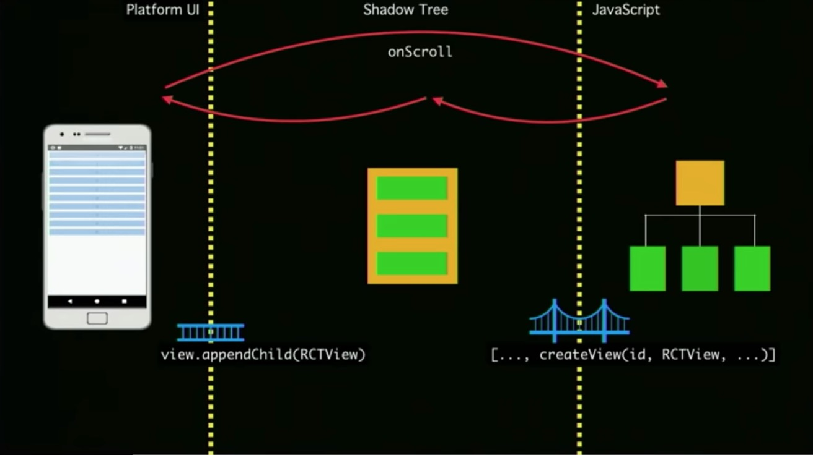
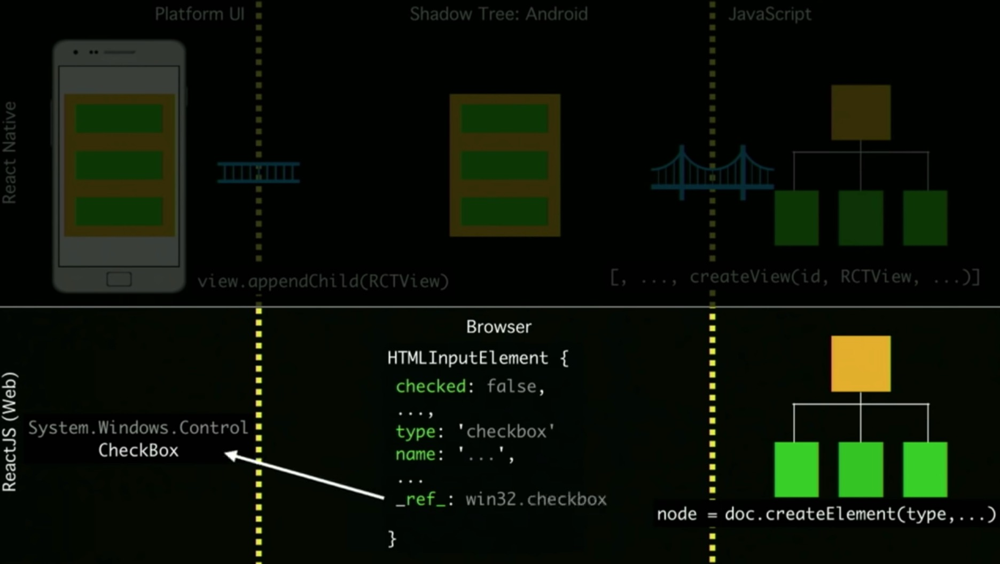
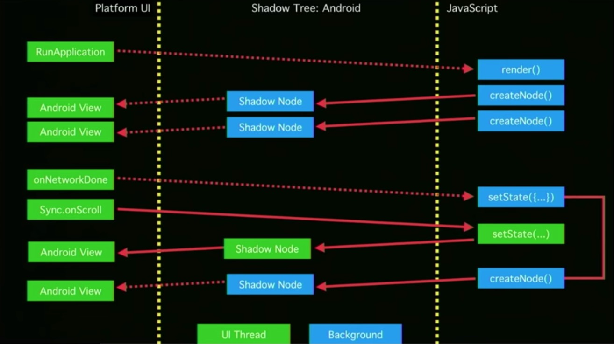
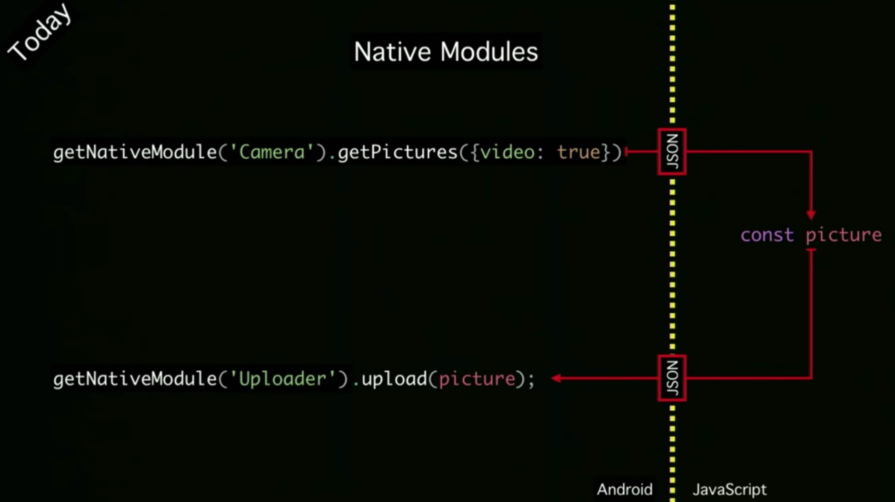
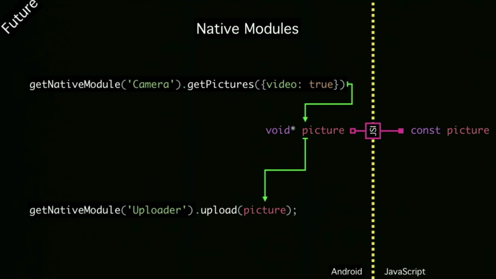

# Faster than faster——RN新架构中的JavaScript Interface

## 背景

随着Flutter等新框架的崛起，React Native正经受着越来越大的挑战，RN性能上的瓶颈愈发明显。为了在与Flutter等框架的对抗中保持竞争力，RN酝酿在架构上进行了一次非常大的升级。于是，在一篇ReactConf 2018的演讲 [React Native's New Architecture](https://www.youtube.com/watch?v=UcqRXTriUVI) 中，RN官方向我们引出了三个新的概念：JSI，Fabric和TurboModule。随后在2019年第一季度，RN开发人员[@kelset](https://github.com/kelset) 写了一篇从高层设计上解释RN为何如此架构的文章： [https://formidable.com/blog/2019/jsi-jsc-part-2/](https://formidable.com/blog/2019/jsi-jsc-part-2/)。下面就让我们来看一看RN是怎么解决性能瓶颈问题的。

### 现有的问题

RN老的架构非常重的依赖于Bridge：

所有的JS和Native之间传递的信息，都要序列化为JSON之后进行异步传输。这样就造成一个比较常见的性能问题：快速滑动ListView的时候会白屏，如下图：

现在有三个线程：Native的UI线程，Layout线程和JS线程，他们之间的通信是异步的。当ListView向上滑动，需要展示新的Cell的时候，Native异步通知到JS线程，JS线程做相应的业务逻辑处理之后，先是异步给到Layout线程，计算Cell的实际显示区域，之后Layout线程再将算好的结果异步给到Native线程进行UI绘制，由于滑动很快，这样就造成UI得不到及时的更新，显示成白屏。

要解决这个问题，我们看一看在浏览器里，ListView是怎么做到没有白屏的问题的。

浏览器返回的node里，是有指向C++实际生成的对象的引用的，所以说，JS向浏览器里的调用是同步调用，自然就不会有白屏的问题。

同样的思路，我们如果去掉这个异步的bridge，JS和Native同时持有一个HostObject，那样就可以进行JS和Native之间的同步调用了，这里就引申出了bridge的替代者——JavaScript Interface (JSI)。

### JavaScript Interface (JSI)

JSI是一个精简通用型的JS引擎接口，理论上可以对接任何JS引擎，包括Google的V8和微软的ChakraCore，或者是RN现在使用的JavaScriptCore（JSC）的新版本（JSI已经集成到RN的0.59版本中，并且在该版本中升级了JSC的版本）。

同时，JSI是架起 JS 和Native之间的桥梁，通过在C++层实现一个 JSI::HostObject，现在不需要序列化成JSON并双向传递等一系列操作，实现了Native和 JS间的直接通讯。

### JSI下的ListView滑动

虚线是异步调用，实现是同步调用。

首先我们RunApplication，之后异步render，然后再异步到UI线程更新View。在JSI出现之前，这是我们Native和JS交互的唯一处理方式。

现在UI线程有一个网络请求更新state的回调，紧接着在UI线程有一个列表的onScroll事件，显然，这个onScroll事件是我们急需处理的任务。有了JSI，我们就可以同步的处理这个onScroll的任务，更新相应的Native View，就不会有白屏的问题出现。处理完这个紧急的任务，主线程可以继续处理网络请求回调的任务了。

### JSI下的Native Modules

JSI同时是Native Modules重构（即TurboModules）的基石。比如现在有一个需求，在RN中拍照并向服务器上传图片。在JSI出现之前，我们需要在JS和Native之间，反复序列化来传递数据，低效且毫无必要：

在有了JSI之后，JS和Native同时持有一个HostObject，获取到图片之后，舍去了不必要的数据传递，直接继续完成上传的操作。

## Reference

[React Native's New Architecture](https://www.youtube.com/watch?v=UcqRXTriUVI)

[https://formidable.com/blog/2019/jsi-jsc-part-2/](https://formidable.com/blog/2019/jsi-jsc-part-2/)

