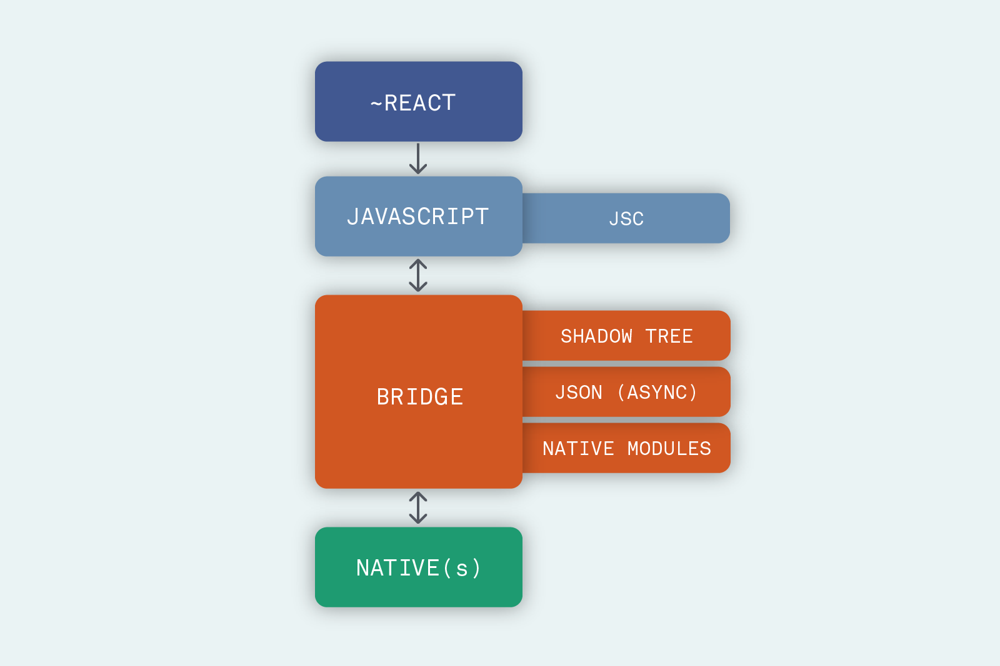
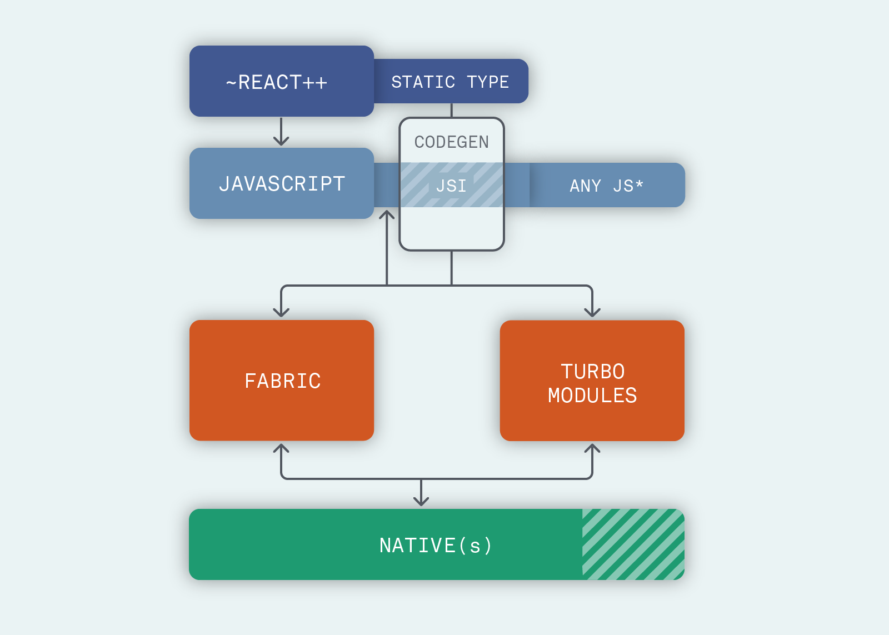

# RN源码学习（iOS）——启动流程

## 前期准备

首先要明确自己使用的RN版本，现在RN的更新很快，不知道现在的代码什么时候就会过时，我现在使用的是0.59.3的RN版本。
在阅读RN源码的时候，这些知识是需要掌握或者了解的：
- 首先要掌握ObjC的runtime方面的知识。我本身是做iOS开发的，所以这点不是问题。
- 然后JS的代码也要能读懂。推荐阮一峰的ES6入门相关文章。
- 最后还有一部分操纵JavaScriptCore的代码是用C++写的，用到了很多C++11的特性。我去学习了一下C++11的语法，才不至于在读相关代码的时候摸不着头脑。

下面我们开始探索RN的启动流程。

## 启动流程

### 初始化RCTBridge

第一步是初始化RCTBridge
```
RCTBridge *rctBridge = [[RCTBridge alloc] initWithBundleURL:rnCodeLocation moduleProvider:nil launchOptions:launchOptions];
```
调用到RCTBridge里的`-(void)setup`方法，然后调用到RCTCxxBridge的`- (void)start`方法，这是个很重要的方法，我们一步步看里面做的事情

### 创建JS运行的线程

```
// Set up the JS thread early
  _jsThread = [[NSThread alloc] initWithTarget:[self class]
                                      selector:@selector(runRunLoop)
                                        object:nil];
  _jsThread.name = RCTJSThreadName;
  _jsThread.qualityOfService = NSOperationQualityOfServiceUserInteractive;
#if RCT_DEBUG
  _jsThread.stackSize *= 2;
#endif
  [_jsThread start];
```
这里单独起了一个线程处理JS，同时绑定了一个RunLoop，后面还会用这个RunLoop初始化RCTMessageThread，所有Native到JS的请求都会走到enqueueJSCall:，并最终调用到[RCTMessageThread runOnQueue:]

### dispatch_group

接下来生成一个dispatch group
```
dispatch_group_t prepareBridge = dispatch_group_create();
```
在group里做这么几件事：modules初始化，NativeToJsBridge初始化，jsbundle源文件加载，我们分别来看一下

### modules初始化

modules初始化代码如下：
```
[self  registerExtraModules];
// Initialize all native modules that cannot be loaded lazily
(void)[self  _initializeModules:RCTGetModuleClasses() withDispatchGroup:prepareBridge lazilyDiscovered:NO];
[self  registerExtraLazyModules];
```

这里将必须在主线程初始化的module提前初始化，最终走到的代码是：
```
// Modules that need to be set up on the main thread cannot be initialized
// lazily when required without doing a dispatch_sync to the main thread,
// which can result in deadlock. To avoid this, we initialize all of these
// modules on the main thread in parallel with loading the JS code, so
// they will already be available before they are ever required.
...
dispatch_block_t block = ^{
...
  (void)[moduleData instance];
...
};
if (initializeImmediately && RCTIsMainQueue()) {
  block();
} else {
  if (dispatchGroup) {
    dispatch_group_async(dispatchGroup, dispatch_get_main_queue(), block);
  }
}
```

在初始化modules的开始，获取modules类列表的代码是`RCTGetModuleClasses()`：

```
NSArray<Class> *RCTGetModuleClasses(void)
{
  __block NSArray<Class> *result;
  dispatch_sync(RCTModuleClassesSyncQueue, ^{
    result = [RCTModuleClasses copy];
  });
  return result;
}
```
而这个RCTModuleClasses是什么呢？我们可以继续搜索找到如下代码：
```
void RCTRegisterModule(Class);
void RCTRegisterModule(Class moduleClass)
{
  static dispatch_once_t onceToken;
  dispatch_once(&onceToken, ^{
    RCTModuleClasses = [NSMutableArray new];
    RCTModuleClassesSyncQueue = dispatch_queue_create("com.facebook.react.ModuleClassesSyncQueue", DISPATCH_QUEUE_CONCURRENT);
  });
...
  // Register module
  dispatch_barrier_async(RCTModuleClassesSyncQueue, ^{
    [RCTModuleClasses addObject:moduleClass];
  });
}
```
而RCTRegisterModule是什么时候调用的呢，这个时候就会发现它是在宏里面调用的，而这个宏就是我们熟悉的`RCT_EXPORT_MODULE`
```
#define RCT_EXPORT_MODULE(js_name) \
RCT_EXTERN void RCTRegisterModule(Class); \
+ (NSString *)moduleName { return @#js_name; } \
+ (void)load { RCTRegisterModule(self); }
```
Aha！原来在`+load`执行的时候就调用了RCTRegisterModule()，将我们要映射到JS的module加进了RCTModuleClasses这个数组。

### NativeToJsBridge初始化

这里的初始化代码如下：
```
  dispatch_group_enter(prepareBridge);
  [self ensureOnJavaScriptThread:^{
    [weakSelf _initializeBridge:executorFactory];
    dispatch_group_leave(prepareBridge);
  }];
```
在`-(void)_initializeBridge:`里调用到了`_buildModuleRegistryUnlocked`方法，之后调用到`createNativeModules`，生成了由RCTNativeModule组成的数组，然后作为初化参数传入ModuleRegistry的构造函数并初始化modules_这个成员变量，后面我们还会见到这个变量。

在调用`-(void)_initializeBridge:`之后一直调用到`void Instance::initializeBridge`这个C++方法
```
void Instance::initializeBridge(
    std::unique_ptr<InstanceCallback> callback,
    std::shared_ptr<JSExecutorFactory> jsef,
    std::shared_ptr<MessageQueueThread> jsQueue,
    std::shared_ptr<ModuleRegistry> moduleRegistry) {
  callback_ = std::move(callback);
  moduleRegistry_ = std::move(moduleRegistry);
  jsQueue->runOnQueueSync([this, &jsef, jsQueue]() mutable {
    nativeToJsBridge_ = folly::make_unique<NativeToJsBridge>(
        jsef.get(), moduleRegistry_, jsQueue, callback_);
...
  });
}
```

这里初始化了一个NativeToJsBridge，其初始化方法如下
```
NativeToJsBridge::NativeToJsBridge(
    JSExecutorFactory* jsExecutorFactory,
    std::shared_ptr<ModuleRegistry> registry,
    std::shared_ptr<MessageQueueThread> jsQueue,
    std::shared_ptr<InstanceCallback> callback)
    : m_destroyed(std::make_shared<bool>(false))
    , m_delegate(std::make_shared<JsToNativeBridge>(registry, callback))
    , m_executor(jsExecutorFactory->createJSExecutor(m_delegate, jsQueue))
    , m_executorMessageQueueThread(std::move(jsQueue)) {}
```
这里还创建了一个JSIExecutor的实例，这里是与JS交互的入口。

### jsbundle源文件加载

源文件加载代码如下：
```
  // Load the source asynchronously, then store it for later execution.
  dispatch_group_enter(prepareBridge);
  __block NSData *sourceCode;
  [self loadSource:^(NSError *error, RCTSource *source) {
    if (error) {
      [weakSelf handleError:error];
    }
    sourceCode = source.data;
    dispatch_group_leave(prepareBridge);
  } onProgress:^(RCTLoadingProgress *progressData) {
...
  }];
```

### dispatch_group_notify

当上面的几项工作都结束，会执行JS代码
```
  // Wait for both the modules and source code to have finished loading
  dispatch_group_notify(prepareBridge, dispatch_get_global_queue(QOS_CLASS_USER_INTERACTIVE, 0), ^{
    RCTCxxBridge *strongSelf = weakSelf;
    if (sourceCode && strongSelf.loading) {
      [strongSelf executeSourceCode:sourceCode sync:NO];
    }
  });
```

最后会调用到`executeSourceCode:sourceCode`，进而一直调用到`JSIExecutor::loadApplicationScript`，会注册`nativeModuleProxy`这个Object和`nativeFlushQueueImmediate`、`nativeCallSyncHook`这两个方法到JS的Runtime中。

在`JSIExecutor::loadApplicationScript`的最后，调用
```
runtime_->evaluateJavaScript(std::make_unique<BigStringBuffer>(std::move(script)), sourceURL);
```
执行加载的JS代码，这里是将JS和Native中的module关联起来的地方。

### Native和JS的方法映射

比如JS中执行这行代码`NativeModules.PlatformConstants.forceTouchAvailable`，NativeModules其实调用的是`NativeModules  =  global.nativeModuleProxy;`，这个nativeModuleProxy就是我们刚才注册到JS里的，这个时候就会调用`JSINativeModules::createModule`，之后是`ModuleRegistry::getConfig`
```
folly::Optional<ModuleConfig> ModuleRegistry::getConfig(const std::string& name) {
...
  // Initialize modulesByName_
  if (modulesByName_.empty() && !modules_.empty()) {
    moduleNames();
  }

  auto it = modulesByName_.find(name);
...
  size_t index = it->second;

  CHECK(index < modules_.size());
  NativeModule *module = modules_[index].get();

  // string name, object constants, array methodNames (methodId is index), [array promiseMethodIds], [array syncMethodIds]
  folly::dynamic config = folly::dynamic::array(name);

  {
    SystraceSection s_("ModuleRegistry::getConstants", "module", name);
    config.push_back(module->getConstants());
  }

  {
    SystraceSection s_("ModuleRegistry::getMethods", "module", name);
    std::vector<MethodDescriptor> methods = module->getMethods();
... // 接下来是将methods放入config的代码
  }

  if (config.size() == 2 && config[1].empty()) {
    // no constants or methods
    return folly::none;
  } else {
    return ModuleConfig{index, config};
  }
}
```
这里用到了modules_这个数组，就是初始化NativeToJSBridge的时候生成的数组，里面保存了Native要导出的modules，这里的代码是找到Native对应的module，将module在数组中的index，module的constants以及methods一起返回。这个index就是JS中对应的moduleId。
我们再来看一下getMethods()，这里调用到-[RCTModuleData methods]，是找到当前类也就是module所在类及其父类的中，以`__rct_export__`开头的静态方法，然后构造RCTModuleMethod的数组返回，那么这个`__rct_export__`开头的方法是哪里来的呢，我们在源码中搜索之后发现下面的宏：

```
#define RCT_EXTERN_METHOD(method) \
_RCT_EXTERN_REMAP_METHOD(, method, NO)

#define _RCT_EXTERN_REMAP_METHOD(js_name, method, is_blocking_synchronous_method) \
  + (const RCTMethodInfo *)RCT_CONCAT(__rct_export__, RCT_CONCAT(js_name, RCT_CONCAT(__LINE__, __COUNTER__))) { \
    static RCTMethodInfo config = {#js_name, #method, is_blocking_synchronous_method}; \
    return &config; \
  }
```

Bingo！我们在自定义的module中写的`RCT_EXTERN_METHOD`，最后会变成以`__rct_export__`开头的静态方法，并最终导出到了JS的执行环境中，实现了JS和Native方法的映射。

### JS和Native交互

我们再看一下JS的消息队列，以及JS代码是如何最终调用到对应的Native代码的。

最终JS向native的模块方法调用都会走到MessageQueue.js中的`enqueueNativeCall()`方法，将JS的调用存储到一个queue里
```
const now = Date.now();
if (
  global.nativeFlushQueueImmediate &&
  now - this._lastFlush >= MIN_TIME_BETWEEN_FLUSHES_MS
) {
  const queue = this._queue;
  this._queue = [[], [], [], this._callID];
  this._lastFlush = now;
  global.nativeFlushQueueImmediate(queue);
}
```
当nativeFlushQueueImmediate（也就是会调用到先前注册到JS中的全局函数）存在且距离上一次调用调用超过5毫秒，JS会调用`global.nativeFlushQueueImmediate(queue);`，在Native中的调用链为：

```
-[JSIExecutor::callNativeModules]
-[JsToNativeBridge::callNativeModules]
-[ModuleRegistry::callNativeMethod(unsigned  int moduleId, unsigned  int methodId, folly::dynamic&& params, int callId)]
	`modules_[moduleId]->invoke(methodId, std::move(params), callId);`
-[RCTNativeModule::invoke]
+[RCTNativeModule::invokeInner]
	`id result = [method invokeWithBridge:bridge module:moduleData.instance arguments:objcParams];`
-(id)invokeWithBridge:module:arguments:
	`-(void)processMethodSignature`
```
在invokeWithBridge中，使用了ObjC的runtime来做消息转发，通过构造一个NSInvocation，最终调用到了RN的module的Native代码。

### 调用flush()

执行完JS代码，会调用`flush();`，里面首先会调用bindBridge()，将JS里的几个函数保存到ObjC中，
```
Object batchedBridge = batchedBridgeValue.asObject(*runtime_);
callFunctionReturnFlushedQueue_ = batchedBridge.getPropertyAsFunction(
    *runtime_, "callFunctionReturnFlushedQueue");
invokeCallbackAndReturnFlushedQueue_ = batchedBridge.getPropertyAsFunction(
    *runtime_, "invokeCallbackAndReturnFlushedQueue");
flushedQueue_ =
    batchedBridge.getPropertyAsFunction(*runtime_, "flushedQueue");
callFunctionReturnResultAndFlushedQueue_ =
    batchedBridge.getPropertyAsFunction(
        *runtime_, "callFunctionReturnResultAndFlushedQueue");
```
然后调用callNativeModules()，将执行JS的消息队列里面的pending的消息，这里就会用到前面初始化的modules了，从里面找对应的方法执行。

### 初始化完成

在start的最后的executeSourceCode中，执行enqueueApplicationScript之后还有一个completion，会发送一个RCTJavaScriptDidLoadNotification通知，至此，RN的初始化完成。之后利用初始化完成的rctBridge新建一个RCTRootView，最终会调用到`runApplication()`方法
```
[bridge enqueueJSCall:@"AppRegistry"
               method:@"runApplication"
                 args:@[moduleName, appParameters]
           completion:NULL];
```
就会调用JS中的AppRegistry.runApplication()，开始界面的渲染了。

## 补充说明

[这里](https://www.formidable.com/blog/2019/react-codegen-part-1/)有几篇关于RN的开发方向的文章，提到RN之前的架构图是



RN新的架构图是



各部分的最新进展为：

>-   new React = 16.8 is supported from version 0.59 (nitpick: Suspense is partially available since 16.6)
>-   CodeGen = development proceeding in the main repository ([dedicated discussion](https://github.com/react-native-community/discussions-and-proposals/issues/92))
>-   JSI = already on master and usable from version 0.59 (but no direct documentation on how to, at the moment) ([dedicated discussion](https://github.com/react-native-community/discussions-and-proposals/issues/91))
>-   TurboModules = development proceeding in the main repository ([dedicated discussion](https://github.com/react-native-community/discussions-and-proposals/issues/40))
>-   Fabric = development proceeding in the main repository ([dedicated discussion](https://github.com/react-native-community/discussions-and-proposals/issues/4))
>-   Lean Core = constantly ongoing, you can refer to this issue for more details ([dedicated discussion](https://github.com/facebook/react-native/issues/23313))

通过看代码还是能看到相对应的一些改变，比如已完成的JSI部分，在RN源码中有一个单独的jsi和jsiexecutor目录，实现了JS引擎的统一接口，达到了两个目的：一是轻松替换JS引擎，二是实现了JS和Native的直接交互。

正在开发的TurboModules，可以看到RCTCxxBridge有一些判断`if (RCTTurboModuleEnabled() && [module conformsToProtocol:@protocol(RCTTurboModule)])`
只是现在还没有实现而已，至于实现之后会有哪些惊艳的效果，让我们拭目以待。

最后，欢迎[发邮件](mailto:bailu1234@gmail.com)交流或批评指正。

## Reference

[react-native框架源码学习(iOS)(上)](http://szuwest.github.io/react-nativekuang-jia-yuan-ma-xue-xi-iosshang.html )

[react-native框架源码学习(iOS)(下)](http://szuwest.github.io/react-nativekuang-jia-yuan-ma-xue-xi-iosxia.html)

[JavaScriptCore全面解析 （上篇）](https://cloud.tencent.com/developer/article/1004875)

[JavaScriptCore全面解析 （下篇）](https://cloud.tencent.com/developer/article/1004876)

[React Native通信机制详解](http://blog.cnbang.net/tech/2698/)


