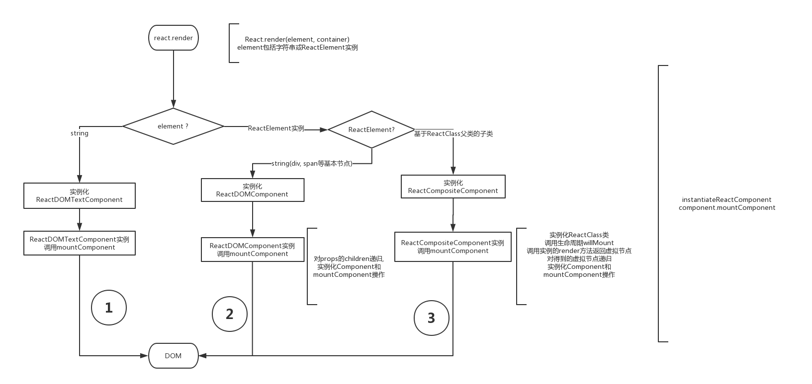

##React中render首次渲染过程

####一.什么是虚拟dom

虚拟DOM就是一个普通的JS对象，通常拥有三个属性，type, props, children。但无状态组件出来后，children改放到props中。此外，有些元素还有ref属性，可以是字符串与函数。在数组里，为了提高diff速度，又多出了key属性。bable会将JSX这些属性转换为一个VNode对象。这是虚拟DOM的最小单元。所有虚拟DOM会组成一棵树，叫虚拟DOM树。
 > 在Web开发中，需要将数据的变化实时反映到UI上，这时就需要对DOM进行操作，但是复杂或频繁的DOM操作通常是性能瓶颈产生的原因,并且DOM是很慢的。如果我们把一个简单的div元素的属性都打印出来，你会看到：
 
 
 
 - 而这仅仅是第一层。真正的 DOM 元素非常庞大，这是因为标准就是这么设计的。而且操作它们的时候你要小心翼翼，轻微的触碰可能就会导致页面重排，这可是杀死性能的罪魁祸首。
相对于 DOM 对象，原生的 JavaScript 对象处理起来更快，而且更简单。DOM 树上的结构、属性信息我们都可以很容易地用 JavaScript 对象表示出来：
 
~~~javascript
 <ul id='ul'>
   <li class='list'>Item 1</li>
   <li class='list'>Item 2</li>
   <li class='list'>Item 3</li>
 </ul>
~~~

html经过babel处理之后

~~~javascript
React.createElement('ul',{ id: 'list' },
  React.createElement('li',{ 'class': 'item' },'Item 1'),
  React.createElement('li',{ 'class': 'item' },'Item 2'),
  React.createElement('li',{ 'class': 'item' },'Item 3')
);
~~~

经过react的createElement处理变成

那具体怎么实现呢？看一下Element方法的具体实现：

~~~javascript
function createElement(type, config, children) {
    var props = {};
    var propName;
    config = config || {};

    var key = config.key || null;

    for (propName in config) {
      if (config.hasOwnProperty(propName) && propName !== "key") {
        props[propName] = config[propName];
      }
    }

    var childrenLength = arguments.length - 2;
    if (childrenLength === 1) {
      props.children = Array.isArray(children) ? children : [children];
    } else if (childrenLength > 1) {
      var childArray = [];
      for (var i = 0; i < childrenLength; i++) {
        childArray[i] = arguments[i + 2];
      }
      props.children = childArray;
    }
    return new ReactElement(type, key, props);
  }
  function ReactElement(type, key, props) {
    this.type = type;
    this.key = key;
    this.props = props;
  }
~~~

React源码中有四种内部组件：

- ReactEmptyComponent（空元素）
- ReactDOMTextComponent（文本or数字）
- ReactDOMComponent（DOM组件元素）
- ReactCompositeComponent（自定义组件元素）

~~~javascript

  hello
  world
  <Test/>

~~~
world 是文本组件   <Test/>为自定义组件  为DOM组件

它们都有以下四个重要方法来管理组件：

- construct用来接收ReactElement进行初始化。
- mountComponent用来生成ReactElement对应的真实DOM节点。
- unmountComponent卸载DOM节点，解绑事件。
- receiveComponent用来接收虚拟DOM的下一个状态，然后进行更新

####理解ReactElement和ReactClass

#####ReactElement

 > 一个描述DOM节点或component实例的字面级对象。它包含一些信息，包括组件类型type和属性props。就像一个描述DOM节点的元素（虚拟节点）。它们可以被创建通过React.createElement方法
分为DOM Element和Component Elements两类：

- DOM Elements（当节点的type属性为字符串时，它代表是普通的节点，如div,span） 

~~~javascript
{
  type: 'button',
  props: {
    className: 'button button-blue',
    children: {
      type: 'b',
      props: {
        children: 'OK!'
      }
    }
  }
}
~~~

- Component Elements（当节点的type属性为一个函数或一个类时，它代表自定义的节点）

~~~javascript
class Button extends React.Component {
  render() {
    const { children, color } = this.props;
    return {
      type: 'button',
      props: {
        className: 'button button-' + color,
        children: {
          type: 'b',
          props: {
            children: children
          }
        }
      }
    };
  }
}
// Component Elements
{
  type: Button,
  props: {
    color: 'blue',
    children: 'OK!'
  }
}
~~~

#####ReactClass

>ReactClass是平时我们写的Component组件(类或函数)，例如上面的Button类。ReactClass实例化后调用render方法可返回DOM Element。

react渲染过程

1. 调用React.render方法，将我们的element根虚拟节点渲染到container元素中。element可以是一个字符串文本元素，也可以是如上介绍的ReactElement(分为DOM Elements, Component Elements)。
2. 根据element的类型不同，分别实例化ReactDOMTextComponent, ReactDOMComponent, ReactCompositeComponent类。这些类用来管理ReactElement,负责将不同的ReactElement转化成DOM(mountComponent方法),负责更新DOM(receiveComponent方法，updateComponent方法, 如下会介绍)等。
3. ReactCompositeComponent实例调用mountComponent方法后内部调用render方法，返回了DOM Elements。再对如图的步骤2递归。

