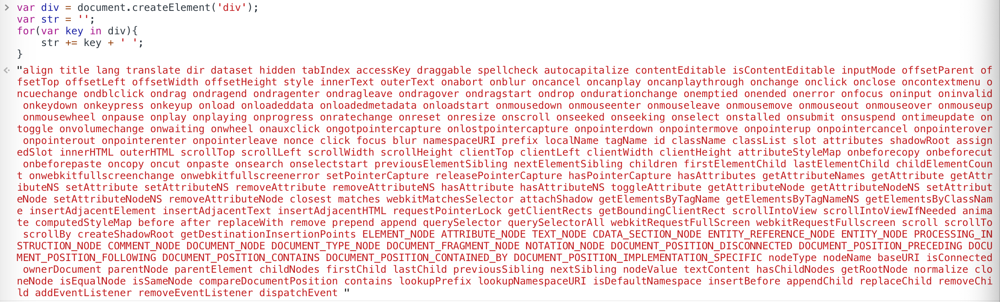
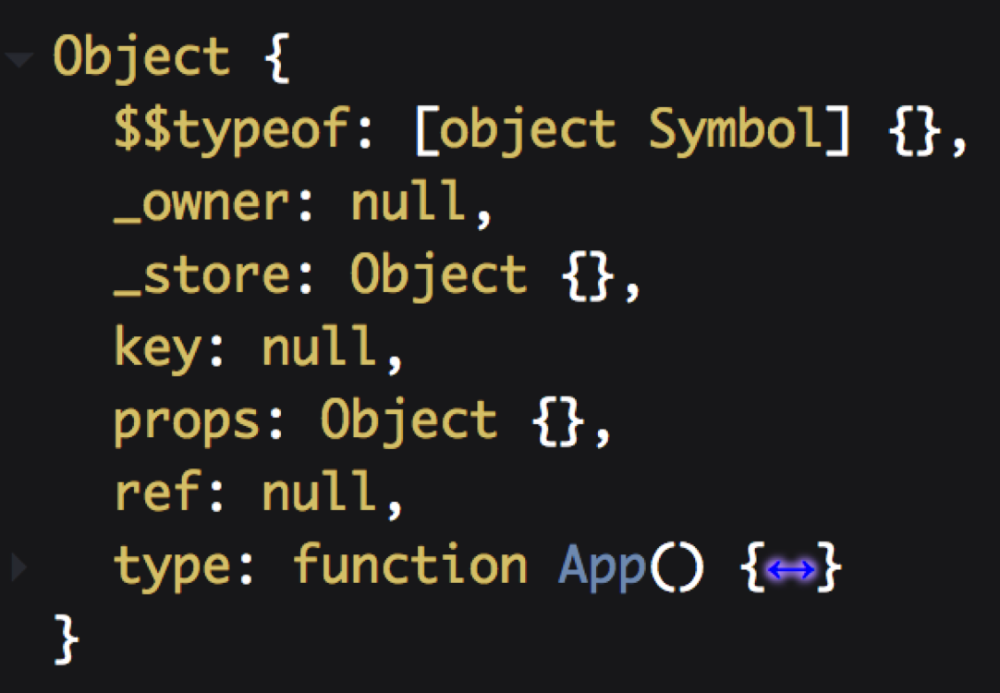

React虚拟DOM简单分享
=========
####一.什么是虚拟dom

虚拟DOM就是一个普通的JS对象，通常拥有三个属性，type, props, children。但无状态组件出来后，children改放到props中。此外，有些元素还有ref属性，可以是字符串与函数。在数组里，为了提高diff速度，又多出了key属性。bable会将JSX这些属性转换为一个VNode对象。这是虚拟DOM的最小单元。所有虚拟DOM会组成一棵树，叫虚拟DOM树。
 > 在Web开发中，需要将数据的变化实时反映到UI上，这时就需要对DOM进行操作，但是复杂或频繁的DOM操作通常是性能瓶颈产生的原因,并且DOM是很慢的。如果我们把一个简单的div元素的属性都打印出来，你会看到：
 
 
 
 - 而这仅仅是第一层。真正的 DOM 元素非常庞大，这是因为标准就是这么设计的。而且操作它们的时候你要小心翼翼，轻微的触碰可能就会导致页面重排，这可是杀死性能的罪魁祸首。
相对于 DOM 对象，原生的 JavaScript 对象处理起来更快，而且更简单。DOM 树上的结构、属性信息我们都可以很容易地用 JavaScript 对象表示出来：
 
~~~javascript
 <ul id='ul'>
   <li class='list'>Item 1</li>
   <li class='list'>Item 2</li>
   <li class='list'>Item 3</li>
 </ul>
~~~
这个用javascript来表示出来:

~~~javascript
 var element = {
   tagName: 'ul', // 节点标签名
   props: { // DOM的属性，用一个对象存储键值对
     id: 'ul'
   },
   children: [ // 该节点的子节点
     {tagName: 'li', props: {class: 'list'}, children: ["Item 1"]},
     {tagName: 'li', props: {class: 'list'}, children: ["Item 2"]},
     {tagName: 'li', props: {class: 'list'}, children: ["Item 3"]},
   ]
 }
~~~

html经过babel处理之后

~~~javascript
React.createElement('ul',{ id: 'list' },
  React.createElement('li',{ 'class': 'item' },'Item 1'),
  React.createElement('li',{ 'class': 'item' },'Item 2'),
  React.createElement('li',{ 'class': 'item' },'Item 3')
);
~~~

经过react的createElement处理变成

那具体怎么实现呢？看一下Element方法的具体实现：

~~~javascript
const RESERVED_PROPS = {
    key: true,
    ref: true,
    __self: true,
    __source: true
};
let hasOwnProperty = Object.prototype.hasOwnProperty;
const REACT_ELEMENT_TYPE = typeof Symbol === 'function' && Symbol['for'] && Symbol['for']('react.element') || 0xeac7;
let ReactElement = function (type, key, ref, self, source, owner, props) {
    var element = {
        $$typeof: REACT_ELEMENT_TYPE,
        type: type,
        key: key,
        ref: ref,
        props: props,
        _owner: owner
    };
    return element;
}
ReactElement.createElement = function(type,config,children) {

    let props = {};
    let key = null;
    let ref = null;
    let self = null;
    let source = null;

    if(config != null){
        if(config.ref !== undefined){
            ref = config.ref;
        }
        if (config.ref !== undefined) {
            key = '' + config.key;
        }

        self = config.__self === undefined ? null : config.__self;
        source = config.__source === undefined ? null : config.__source;

        for (let propName in config) {
            if (hasOwnProperty.call(config, propName) && !RESERVED_PROPS.hasOwnProperty(propName)) {
                props[propName] = config[propName];
            }
        }
    }
    // 入参的前两个为type和config，后面的就都是children参数了。故需要减2
    let childrenLength = arguments.length - 2;
    if (childrenLength === 1) {
        //// 只有一个参数时，直接挂到children属性下，不是array的方式
        props.children = children;
    } else if (childrenLength > 1) {
        // 不止一个时，放到array中，然后将array挂到children属性下
        var childArray = Array(childrenLength);
        for (var i = 0; i < childrenLength; i++) {
            childArray[i] = arguments[i + 2];
        }
        props.children = childArray;
    }

    //取出组件类中的静态变量defaultProps，并给未在JSX中设置值的属性设置默认值
    if (type && type.defaultProps) {
        var defaultProps = type.defaultProps;
        for (let propName in defaultProps) {
            if (props[propName] === undefined) {
                props[propName] = defaultProps[propName];
            }
        }
    }
    const ReactCurrentOwner = null;
    return ReactElement(type, key, ref, self, source, ReactCurrentOwner, props);
}
~~~

React源码中有三种内部组件：

- ReactDOMTextComponent用来管理text node对应的ReactElement。
- ReactDOMComponent用来管理html标签对应的ReactElement。
- ReactCompositeComponent用来管理自定义组件对应的ReactElement。

它们都有以下四个重要方法来管理组件：

- construct用来接收ReactElement进行初始化。
- mountComponent用来生成ReactElement对应的真实DOM节点。
- unmountComponent卸载DOM节点，解绑事件。
- receiveComponent用来接收虚拟DOM的下一个状态，然后进行更新

#####二.如果直接操作原生DOM

如果没有 Virtual DOM，简单来说就是直接重置 innerHTML。这样操作，在一个大型列表所有数据都变了的情况下，还算是合理，但是，当只有一行数据发生变化时，它也需要重置整个 innerHTML，这时候显然就造成了大量浪费。
比较innerHTML 和Virtual DOM 的重绘过程如下：

- innerHTML: render html string + 重新创建所有 DOM 元素

- Virtual DOM: render Virtual DOM + diff + 必要的 DOM 更新

和 DOM 操作比起来，js 计算是非常便宜的。Virtual DOM render + diff 显然比渲染 html 字符串要慢，但是，它依然是纯 js 层面的计算，比起后面的 DOM 操作来说，依然便宜了太多。
* React 从来没有说过 “React 比原生操作 DOM 快”。React给我们的保证是，在不需要手动优化的情况下，它依然可以给我们提供过得去的性能。

####三.什么是 DOM Diff 算法

传统 diff 算法的复杂度为 O(n^3)，显然这是无法满足性能要求的。React 通过制定大胆的策略，将 O(n^3) 复杂度的问题转换成 O(n) 复杂度的问题。
diff算法在Virtual-DOM中用于比较两个VNode树之间的不同，得到patch对象，之后根据patch对象来对真实DOM树进行修改
Virtual-DOM的执行过程:

用JS对象模拟DOM树 -> 比较两棵虚拟DOM树的差异 -> 把差异应用到真正的DOM树上

这就是所谓的 Virtual DOM 算法。包括几个步骤：

1. 用 JavaScript 对象结构表示 DOM 树的结构；然后用这个树构建一个真正的 DOM 树，插到文档当中
2. 当状态变更的时候，重新构造一棵新的对象树。然后用新的树和旧的树进行比较，记录两棵树差异
3. 把2所记录的差异应用到步骤1所构建的真正的DOM树上，视图就更新了

>深度优先遍历，记录差异

在实际的代码中，会对新旧两棵树进行一个深度优先的遍历，这样每个节点都会有一个唯一的标记： 
 
>三个策略

1. Web UI 中 DOM 节点跨层级的移动操作特别少，可以忽略不计。

2. 拥有相同类的两个组件将会生成相似的树形结构，拥有不同类的两个组件将会生成不同的树形结构。

3. 对于同一层级的一组子节点，它们可以通过唯一 id 进行区分。

基于以上三个前提策略，React 分别对 tree diff、component diff 以及 element diff 进行算法优化，事实也证明这三个前提策略是合理且准确的，它保证了整体界面构建的性能。

既然 DOM 节点跨层级的移动操作少到可以忽略不计，针对这一现象，React 通过 nextMountIndex 对 Virtual DOM 树进行层级控制，只会对相同颜色方框内的 DOM 节点进行比较，即同一个父节点下的所有子节点。当发现节点已经不存在，则该节点及其子节点会被完全删除掉，不会用于进一步的比较。这样只需要对树进行一次遍历，便能完成整个 DOM 树的比较。

注意：当出现节点跨层级移动时，并不会出现想象中的移动操作，而是出现新建和删除操作。React 官方建议不要进行 DOM 节点跨层级的操作。在开发组件时，保持稳定的 DOM 结构会有助于性能的提升。例如，可以通过 CSS 隐藏或显示节点，而不是真的移除或添加 DOM 节点。

React diff 的执行情况：create A -> create B -> create C -> delete A。

#####component diff

React 是基于组件构建应用的，对于组件间的比较所采取的策略也是简洁高效。
如果是同一类型的组件，按照原策略继续比较 virtual DOM tree。如果不是，则替换整个组件下的所有子节点。

当 component D 改变为 component G 时，即使这两个 component 结构相似，一旦 React 判断 D 和 G 是不同类型的组件，就不会比较二者的结构，而是直接删除 component D，重新创建 component G 以及其子节点。虽然当两个 component 是不同类型但结构相似时，React diff 会影响性能，但正如 React 官方博客所言：不同类型的 component 是很少存在相似 DOM tree 的机会，因此这种极端因素很难在实现开发过程中造成重大影响的。

#####element diff

当节点处于同一层级时，React diff 提供了三种节点操作
1. INSERT_MARKUP（插入），新的 component 类型不在老集合里， 即是全新的节点，需要对新节点执行插入操作。

2. MOVE_EXISTING（移动），在老集合有新 component 类型，且 element 是可更新的类型，generateComponentChildren 已调用 receiveComponent，这种情况下 prevChild=nextChild，就需要做移动操作，可以复用以前的 DOM 节点。

3. REMOVE_NODE（删除），老 component 类型，在新集合里也有，但对应的 element 不同则不能直接复用和更新，需要执行删除操作，或者老 component 不在新集合里的，也需要执行删除操作。

React 提出优化策略：允许开发者对同一层级的同组子节点，添加唯一 key 进行区分，虽然只是小小的改动，性能上却发生了翻天覆地的变化！
新老集合所包含的节点，如下图所示，新老集合进行 diff 差异化对比，通过 key 发现新老集合中的节点都是相同的节点，因此无需进行节点删除和创建，只需要将老集合中节点的位置进行移动，更新为新集合中节点的位置，此时 React 给出的 diff 结果为：B、D 不做任何操作，A、C 进行移动操作，即可。

首先对新集合的节点进行循环遍历，for (name in nextChildren)，通过唯一 key 可以判断新老集合中是否存在相同的节点，if (prevChild === nextChild)，如果存在相同节点，则进行移动操作，但在移动前需要将当前节点在老集合中的位置与 lastIndex 进行比较，if (child._mountIndex < lastIndex)，则进行节点移动操作，否则不执行该操作。这是一种顺序优化手段，lastIndex 一直在更新，表示访问过的节点在老集合中最右的位置（即最大的位置），如果新集合中当前访问的节点比 lastIndex 大，说明当前访问节点在老集合中就比上一个节点位置靠后，则该节点不会影响其他节点的位置，因此不用添加到差异队列中，即不执行移动操作，只有当访问的节点比 lastIndex 小时，才需要进行移动操作。
以上图为例，可以更为清晰直观的描述 diff 的差异对比过程：

- 从新集合中取得 B，判断老集合中存在相同节点 B，通过对比节点位置判断是否进行移动操作，B 在老集合中的位置 B._mountIndex = 1，此时 lastIndex = 0，不满足 child._mountIndex < lastIndex 的条件，因此不对 B 进行移动操作；更新 lastIndex = Math.max(prevChild._mountIndex, lastIndex)，其中 prevChild._mountIndex 表示 B 在老集合中的位置，则 lastIndex ＝ 1，并将 B 的位置更新为新集合中的位置prevChild._mountIndex = nextIndex，此时新集合中 B._mountIndex = 0，nextIndex++ 进入下一个节点的判断。

- 从新集合中取得 A，判断老集合中存在相同节点 A，通过对比节点位置判断是否进行移动操作，A 在老集合中的位置 A._mountIndex = 0，此时 lastIndex = 1，满足 child._mountIndex < lastIndex的条件，因此对 A 进行移动操作enqueueMove(this, child._mountIndex, toIndex)，其中 toIndex 其实就是 nextIndex，表示 A 需要移动到的位置；更新 lastIndex = Math.max(prevChild._mountIndex, lastIndex)，则 lastIndex ＝ 1，并将 A 的位置更新为新集合中的位置 prevChild._mountIndex = nextIndex，此时新集合中A._mountIndex = 1，nextIndex++ 进入下一个节点的判断。

- 从新集合中取得 D，判断老集合中存在相同节点 D，通过对比节点位置判断是否进行移动操作，D 在老集合中的位置 D._mountIndex = 3，此时 lastIndex = 1，不满足 child._mountIndex < lastIndex的条件，因此不对 D 进行移动操作；更新 lastIndex = Math.max(prevChild._mountIndex, lastIndex)，则 lastIndex ＝ 3，并将 D 的位置更新为新集合中的位置 prevChild._mountIndex = nextIndex，此时新集合中D._mountIndex = 2，nextIndex++ 进入下一个节点的判断。

- 从新集合中取得 C，判断老集合中存在相同节点 C，通过对比节点位置判断是否进行移动操作，C 在老集合中的位置 C._mountIndex = 2，此时 lastIndex = 3，满足 child._mountIndex < lastIndex 的条件，因此对 C 进行移动操作 enqueueMove(this, child._mountIndex, toIndex)；更新 lastIndex = Math.max(prevChild._mountIndex, lastIndex)，则 lastIndex ＝ 3，并将 C 的位置更新为新集合中的位置 prevChild._mountIndex = nextIndex，此时新集合中 C._mountIndex = 3，nextIndex++ 进入下一个节点的判断，由于 C 已经是最后一个节点，因此 diff 到此完成。

以上主要分析新老集合中存在相同节点但位置不同时，对节点进行位置移动的情况，如果新集合中有新加入的节点且老集合存在需要删除的节点，那么 React diff 又是如何对比运作的呢？

以下图为例：

- 从新集合中取得 B，判断老集合中存在相同节点 B，由于 B 在老集合中的位置 B._mountIndex = 1，此时lastIndex = 0，因此不对 B 进行移动操作；更新 lastIndex ＝ 1，并将 B 的位置更新为新集合中的位置B._mountIndex = 0，nextIndex++进入下一个节点的判断。

- 从新集合中取得 E，判断老集合中不存在相同节点 E，则创建新节点 E；更新 lastIndex ＝ 1，并将 E 的位置更新为新集合中的位置，nextIndex++进入下一个节点的判断。

- 从新集合中取得 C，判断老集合中存在相同节点 C，由于 C 在老集合中的位置C._mountIndex = 2，lastIndex = 1，此时 C._mountIndex > lastIndex，因此不对 C 进行移动操作；更新 lastIndex ＝ 2，并将 C 的位置更新为新集合中的位置，nextIndex++ 进入下一个节点的判断。

- 从新集合中取得 A，判断老集合中存在相同节点 A，由于 A 在老集合中的位置A._mountIndex = 0，lastIndex = 2，此时 A._mountIndex < lastIndex，因此对 A 进行移动操作；更新 lastIndex ＝ 2，并将 A 的位置更新为新集合中的位置，nextIndex++ 进入下一个节点的判断。

当完成新集合中所有节点 diff 时，最后还需要对老集合进行循环遍历，判断是否存在新集合中没有但老集合中仍存在的节点，发现存在这样的节点 D，因此删除节点 D，到此 diff 全部完成。

当然，React diff 还是存在些许不足与待优化的地方，如下图所示，若新集合的节点更新为：D、A、B、C，与老集合对比只有 D 节点移动，而 A、B、C 仍然保持原有的顺序，理论上 diff 应该只需对 D 执行移动操作，然而由于 D 在老集合的位置是最大的，导致其他节点的 _mountIndex < lastIndex，造成 D 没有执行移动操作，而是 A、B、C 全部移动到 D 节点后面的现象。
;

#####源码分析
~~~javascript
 function _updateChildren(nextNestedChildrenElements, transaction, context) {
    var prevChildren = this._renderedChildren;
    var removedNodes = {};
    var mountImages = [];

    // 获取新的子元素数组
    var nextChildren = this._reconcilerUpdateChildren(
      prevChildren,
      nextNestedChildrenElements,
      mountImages,
      removedNodes,
      transaction,
      context
    );

    if (!nextChildren && !prevChildren) {
      return;
    }

    var updates = null;
    var name;
    var nextIndex = 0;
    var lastIndex = 0;
    var nextMountIndex = 0;
    var lastPlacedNode = null;

    for (name in nextChildren) {
      if (!nextChildren.hasOwnProperty(name)) {
        continue;
      }
      var prevChild = prevChildren && prevChildren[name];
      var nextChild = nextChildren[name];
      if (prevChild === nextChild) {
        // 同一个引用，说明是使用的同一个component,所以我们需要做移动的操作
        // 移动已有的子节点
        // NOTICE：这里根据nextIndex, lastIndex决定是否移动
        updates = enqueue(
          updates,
          this.moveChild(prevChild, lastPlacedNode, nextIndex, lastIndex)
        );

        // 更新lastIndex
        lastIndex = Math.max(prevChild._mountIndex, lastIndex);
        // 更新component的.mountIndex属性
        prevChild._mountIndex = nextIndex;

      } else {
        if (prevChild) {
          // 更新lastIndex
          lastIndex = Math.max(prevChild._mountIndex, lastIndex);
        }

        // 添加新的子节点在指定的位置上
        updates = enqueue(
          updates,
          this._mountChildAtIndex(
            nextChild,
            mountImages[nextMountIndex],
            lastPlacedNode,
            nextIndex,
            transaction,
            context
          )
        );

        nextMountIndex++;
      }

      // 更新nextIndex
      nextIndex++;
      lastPlacedNode = ReactReconciler.getHostNode(nextChild);
    }

    // 移除掉不存在的旧子节点，和旧子节点和新子节点不同的旧子节点
    for (name in removedNodes) {
      if (removedNodes.hasOwnProperty(name)) {
        updates = enqueue(
          updates,
          this._unmountChild(prevChildren[name], removedNodes[name])
        );
      }
    }
  }
~~~

