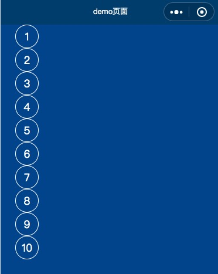
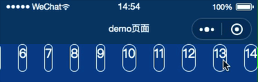
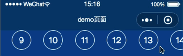
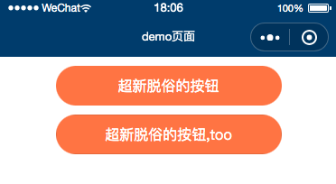
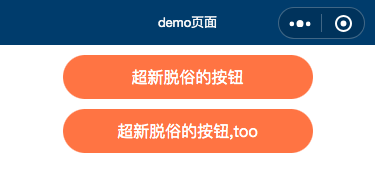
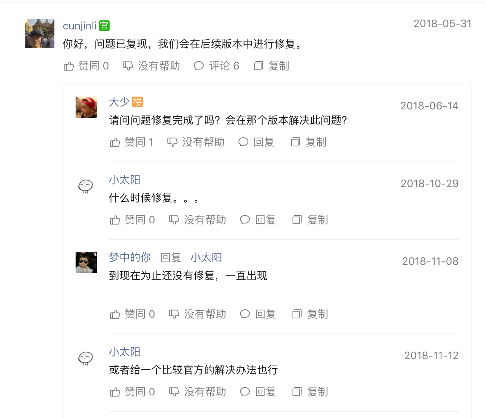
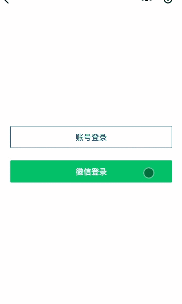
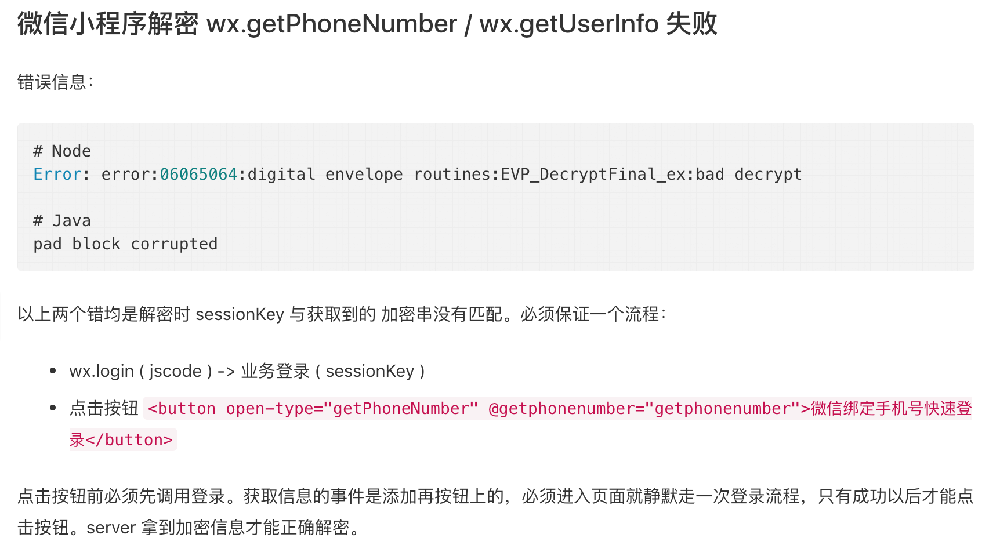
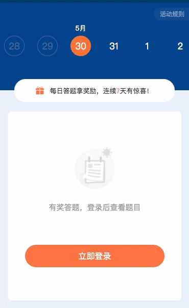

## 微信小程序降(小)妖伏(小)魔篇

> 开发就是一个西行取经的过程，期间不是一帆风顺，不定会遇到什么鬼。
> 
> 最近开发一个简单的每日答题签到小程序，期间遇到一些始料未及的坑记录一下，避免日后重复踩坑。本文针对初入小程序的小白。:)
> 
> 可能会有更好的解决方案，欢迎指正。


**多张gif图预警，大概20M 😱**

### 第一难: scroll-view标签对dispay:flex无效

想要实现一个横向滚动的日历，很自然的想到scroll-view组件，于是洋洋洒洒的写下几行代码:

demo.wxml

```
<scroll-view
        scroll-x="true"
        class="scroll-view-demo"
>
    <view class="item" wx:for="{{[1,2,3,4,5,6,7,8,9,10,11,12,13,14]}}" wx:key="{{index}}">
        {{item}}
    </view>
</scroll-view>
```

demo.scss(为了写着方便，请自行转换成wxss语法，下同)

```
page {
  width: 100%;
  height: 100%;
  background: #17448E;
}
.scroll-view-demo {
  display: flex;
  flex-direction: row;
  .item {
    width: 80rpx;
    height: 80rpx;
    border: solid 1px #fff;
    display: flex;
    color: #fff;
    font-size: 36rpx;
    justify-content: center;
    align-items: center;
    border-radius: 40rpx;
    margin-left: 50rpx;
  }
}
```

搓搓手，看看效果



尴尬,说好的横向滚动呢，明明`flex-direction: row;`写的清清楚楚明明白白。。

既然`scroll-view`对`flex`不友好，那我在子元素上再包裹一层`view`组件应该万事大吉了吧，于是:

demo.wxml

```
<scroll-view
        scroll-x="true"
        class="scroll-view-demo"
>
    <view class="item-container">
        <view class="item" wx:for="{{[1,2,3,4,5,6,7,8,9,10,11,12,13,14]}}" wx:key="{{index}}">
            {{item}}
        </view>
    </view>
</scroll-view>
```

demo.scss

```
.scroll-view-demo {
  .item-container {
    display: flex;
    flex-direction: row;
    .item {
      width: 80rpx;
      height: 80rpx;
      border: solid 1px #fff;
      display: flex;
      color: #fff;
      font-size: 36rpx;
      justify-content: center;
      align-items: center;
      border-radius: 40rpx;
      margin-left: 50rpx;
    }
  }
}
```
看看效果:



然鹅。。好像不是那么回事，子元素怎么就被挤成胶囊了。。 仔细研究一番，需要给`.item-container`加上固定的`width`才行，甚是麻烦。

简单点，开发的方式简单点，既然`scroll-view`对`flex`如此高冷，那就换一种方式:

demo.wxml

```
<scroll-view
        scroll-x="true"
        class="scroll-view-demo"
>
    <view class="item" wx:for="{{[1,2,3,4,5,6,7,8,9,10,11,12,13,14]}}" wx:key="{{index}}">
        {{item}}
    </view>
</scroll-view>
```
demo.scss

```
.scroll-view-demo {
  width: 100%;
  white-space: nowrap;
  .item {
    width: 80rpx;
    height: 80rpx;
    line-height: 80rpx;
    text-align: center;
    border: solid 1px #fff;
    display: inline-block;
    color: #fff;
    font-size: 36rpx;
    border-radius: 40rpx;
    margin-left: 50rpx;
  }
```
效果:



两个字，接近完美😆
 
不过，在手机上浏览`scroll-view`会有一个**滚动条**，很丑有木有

于是挑灯夜读翻阅资料找到解决方法:

app.css

```
/*隐藏scroll-view滚动条*/
::-webkit-scrollbar{
  width: 0;
  height: 0;
  color: transparent;
}
```

这下妥妥的了,

> 年轻人切记，`scroll-view` 尽量不用`flex`

#### 第二难: scroll-view 设置scroll-left无效问题

以为`scroll-view`踩完一个坑就结束了么，图森破图样。

想给`scroll-view`在页面loading结束后滚动到某一个位置，
很简单，闭着眼写代码:

demo.wxml

```
<scroll-view
            scroll-x="true"
            class="daily-check-calendar-scroll"
            scroll-left="{{scrollLeft}}"
        >
        <view class="item" wx:for="{{list}}" wx:key="{{index}}">
	        {{item}}
	    </view>
</scroll-view>
```
demo.js

```
Page({
	data: {
		scrollLeft: 100,
		list: []
	},
	onLoad(){
		setTimeout(()=>{
			//假装异步获取数据
			this.setData({
				list: [1,2,3,4,5,6,7,8]
			});
		},1000);
	}
})
```
看效果，发现`scroll-view`带在原地纹丝不动。惆怅~

let me see see
代码稍作改动:

demo.js

```
Page({
	data: {
		scrollLeft: 0,
		list: []
	},
	onLoad(){
		setTimeout(()=>{
			//假装异步获取数据
			this.setData({
				list: [1,2,3,4,5,6,7,8],
				scrollLeft: 100
			});
		},1000);
	}
})

```

**perfect** 果然达到了预期，细想原因:

* 一般在页面加载时我们会请求数据,并渲染列表, 但是我们在标签或者`data`中设置的`scroll-left`值会在数据渲染前赋值.
* 此时的`scroll-view`中还是空的,所以`scroll-left`不会生效. 我们应该在数据渲染到`scroll-view`中以后,再同步`scroll-left`的值

#### 第三难: button自定义样式，无法去掉默认样式

想写一个自定义样式的按钮，so easy,给我一秒写出来:

demo.wxml

```
<view class="button">超新脱俗的按钮</view>
<button>超新脱俗的按钮,too</button>
```

demo.scss

```
button,
.button {
  width: 500rpx;
  height: 88rpx;
  display: flex;
  align-items: center;
  justify-content: center;
  font-size: 32rpx;
  background: #FE7437;
  color: #fff;
  border-radius: 44rpx;
  margin: 20rpx auto;
}
```

效果:



猛一看，感觉不能再完美了，定睛一看，怎么觉得`button`组件写出来的按钮不是那么纯洁，有阴影。

很自然的再加行代码:

demo.scss

```
border: none;
```

事情并没有那么简单，阴影依然噩梦般存在。
有困难，找百度，果不其然大神们的奇技淫巧顺利解决，贴上完整代码:

demo.scss

```
button,
.button {
  width: 500rpx;
  height: 88rpx;
  display: flex;
  align-items: center;
  justify-content: center;
  font-size: 32rpx;
  background: #FE7437;
  color: #fff;
  border-radius: 44rpx;
  margin: 20rpx auto;
  &::after{
    border-radius: 0;
    border: none;
  }
}
```

效果:



 简直两个按钮一模一样。

#### 第四难 让人伤神的input组件

小程序开发免不了要有登录页面，于是就离不开`input`组件，代码就不贴了，常规操作，直接上图。


看图很容易发现几个问题:

1. 切换`input`时 文字会闪动
2. 切换下一个`input`时 需要多次才能获取到焦点，弹出键盘。
3. 如果在不同的手机上看，会发现密码框的黑点大小也不一致

针对第一个问题，百度谷歌挖地三尺也木有找到好的解决办法(可能是挖的不够深 :()
第二个问题，既然不能自主获取焦点，那我们结合官方文档助它一臂之力:

demo.wxml

```
<view class="account-main">
    <text class="account-title">登录</text>
    <form class="login-form" bindsubmit="formSubmit">
        <view class="form-item {{selectName ? 'selected' : ''}}">
            <input type="text" value="{{username}}" focus="{{selectName}}" bindtap="handleName" bindinput="getUsername" placeholder-class="login-ipt-place" class="login-ipt" placeholder="手机号/邮箱" />
        </view>
        <view class="form-item {{selectPwd ? 'selected' : ''}}">
            <input type="text" value="{{password}}" focus="{{selectPwd}}" bindtap="handlePwd" bindinput='getPassword' placeholder-class="login-ipt-place"  maxlength="48" class="login-ipt pwd-ipt" placeholder="登录密码" password="true" />
        </view>
        <button class="form-submit" form-type="submit">
            登录
        </button>
    </form>
</view>
```

demo.scss

```
...
```

demo.js

```
Page({
    data: {
        username: '',
        password: '',
        selectName: true,
        selectPwd: false,
    },
    getUsername(e){
        //获取用户名
        this.setData({
            username: e.detail.value,
        });
    },
    getPassword(e){
        //获取密码
        this.setData({
            password: e.detail.value,
        })
    },
    handleName(){
        this.setData({
            selectName: true,
            selectPwd: false,
        })
    },
    handlePwd(){
        this.setData({
            selectName: false,
            selectPwd: true,
        })
    }
});
```

看看效果:


看着像是好多了 😆
思考: 若文本框不止两个，怎么写才更优雅，另，没有看在不同手机上的表现。

第三个关于密码黑点大小的问题 我也木有良策 +_+

以下是网上大佬们关于`input`组件bug的总结:

* `placeholder` 文字与 `input` 的值重叠 暂无解决方法

* 获取焦点 和 失去焦点 时，光标和文字跳动 暂无解决方法

* 当 `input` 设置为居中对齐时，光标会出现在奇怪的位置 暂无解决方法

* `bindconfirm` 事件在失去焦点时也会触发，类似于 `blur` 暂无解决方法

* 对 `input` 做动画时，如果是获取焦点状态，会失效 暂无解决方案，因为 input 在获取焦点时是native 组件，失去焦点后改回 web 组件

* `type` 为 `idcard`, `digit` 时并不是调用数字键盘 暂无解决方案，目前起作用的只有 `number`

* 在`input`聚焦期间，不能做`css`动画，否则`input`中的`placeholder`会错位，如果动画和聚焦都想要的话，那么可以在动画完成之后，再设置聚焦

看看微信官方社区的吐槽，如果你也被坑了，去给助个攻吧



[传送门](https://developers.weixin.qq.com/community/develop/doc/00006adff689980f46d67262651800?_at=1559133433615)

#### 第五难 getPhoneNumber获取用户手机号解密报错问题

小程序登录时我们可以利用微信获取手机号快捷登录，根据文档我们很容易写一套登录流程:

demo.wmxl

```
<button class="login-by-wx" open-type="getPhoneNumber"  bindgetphonenumber="getPhoneNumber">
    微信登录
</button>
```

demo.js

```
Page({
	...
	async getPhoneNumber(e) {
		if(!e.detail.iv){
            //被拒绝授权
            return;
        }
        
        let code = '';
        
         /*
    	  * 别慌，wxPromise.login()其实就是wx的api被promise化，参考 **转转**代码
    	  * https://github.com/zhuanzhuanfe/fancy-mini/blob/master/src/wxPromise.js
    	  */
    	  const res = await wxPromise.login();
    	  code = res.code;
    	  
    	  if(!code){
    	  	console.error(`调用 wx.login 失败`, err);
            return util.toast('微信登录失败');
    	  }
        
        try{
        	//server端微信登录接口
            const result = await service.passport.wxLogin({
                data: {
                    code: code,
                    iv: e.detail.iv,
                    encryptedData:  e.detail.encryptedData
                }
            });
            const res = result.data;
            if (res.status === 0) {
                // 登录成功
               	...
            }else {
                ...
            }

        }catch(err){
           ...
        }
        
	}
	...
});

```

server.js

```
async wxLoginAction(){
	//微信登录
        const {ctx} = this;
        const body = ctx.request.body;
        //请求微信接口 https://api.weixin.qq.com/sns/jscode2session
        const result = await this.callService('wxApplet.code2Session', {
            appid: ***,
            secret: ***,
            js_code: body.code,
            grant_type: 'authorization_code'
        });
        
        if(result.status == 0){
        	let sessionKey = result.data.session_key;
            let encryptedData = body.encryptedData;
            let iv = body.iv;
            //解密获取手机号 (解密库小程序文档有对应的源码)
            let pc = new WXBizDataCrypt(appid, sessionKey);
            let mobile = pc.decryptData(encryptedData, iv).phoneNumber;
            
            //解密成功 生成登录态等操作
            ...
            
            return this.json({
            	status: 0,
            	message: 'ok',
            	data: mobile
            });
            
        }else {
        	....
        }
}
```

搓搓手，看效果:



竟然首次登录的时候有报错，以后再次登录却一切正常。

看server端报错日志，如下:

```
Error: error:06065064:digital envelope routines:EVP_DecryptFinal_ex:bad decrypt
```
这条`error`信息是从`WXBizDataCrypt`解密失败时抛出来的。

查看文档，看button的官方文档Tips中有这一条:

> 在bindgetphonenumber 等返回加密信息的回调中调用 wx.login 登录，可能会刷新登录态。此时服务器使用 code 换取的 sessionKey 不是加密时使用的 sessionKey，导致解密失败。建议开发者提前进行 login；或者在回调中先使用 checkSession 进行登录态检查，避免 login 刷新登录态。

另外，查看网上大神的解决方案，其中有一条是这样说的:



纳尼，点击按钮之前就要调用`login`,于是将信将疑的再次修改代码:

demo.js

```
Page({
	data: {
		code: ''
	},
	async onLoad(options){
		try {
            const res = await wxPromise.login();
            this.setData({
                code: res.code
            })
        }catch (err){
            this.setData({
                code: ''
            })
        }
	},
	async getPhoneNumber(e) {
		if(!e.detail.iv){
            //被拒绝授权
            return;
        }
        let code = this.data.code;
        if(!code){
    	  	console.error(`调用 wx.login 失败`, err);
            return util.toast('微信登录失败');
    	  }
        
        try{
        	//server端微信登录接口
            const result = await service.passport.wxLogin({
                data: {
                    code: code,
                    iv: e.detail.iv,
                    encryptedData:  e.detail.encryptedData
                }
            });
            const res = result.data;
            if (res.status === 0) {
                // 登录成功
               	...
            }else {
                ...
            }

        }catch(err){
           ...
        }
	}
});
```

修改完毕，经过测试，首次登录果然很顺利就成功了，但是又出现了一个幺蛾子，再次登录就又又又报错:

```
error: code is used
```
这个报错就很好理解了，稍稍修改一下代码:

demo.js

```
Page({
	data: {
		code: ''
	},
	async onLoad(options){
		try {
            const res = await wxPromise.login();
            this.setData({
                code: res.code
            })
        }catch (err){
            this.setData({
                code: ''
            })
        }
	},
	async getPhoneNumber(e) {
		if(!e.detail.iv){
            //被拒绝授权
            return;
        }
        let code = this.data.code;
        
        if (!code) {
            //防止code失效
            try{
                const res = await wxPromise.login();
                code = res.code;
            }catch(err){
                this.setData({
                    loading: false
                });
                console.error(`调用 wx.login 失败`, err);
                return util.toast('微信登录失败');
            }
        }
        
        try{
        	//server端微信登录接口
            const result = await service.passport.wxLogin({
                data: {
                    code: code,
                    iv: e.detail.iv,
                    encryptedData:  e.detail.encryptedData
                }
            });
            const res = result.data;
            
            this.setData({
                //用过的code需要清空，重新获取
                code: ''
            });
            
            if (res.status === 0) {
                // 登录成功
               	...
            }else {
                ...
            }

        }catch(err){
           ...
        }
	}
});
```
泪流满面，自我测试，确实经得起组织考验，完美解决。(也可能测试的不够透彻，如果还有报错，或者更好的解决方案，欢迎打脸T T)

#### 第六难 刷新页面图片加载时变形问题

`image`组件开发时特别常见，要写一个宽度固定，高度自适应代码也很简单:

demo.wxml

```
<image
    mode = "widthFix"
    src="你的图片地址"
>
</image>
```
看着很简单，感觉稳稳地，但是刷新页面时会有中见鬼的赶脚，话不多说上图:



仔细看似乎有鬼影掠过。。。 加载时图片被拉扯变形，😱

其实解决方法也很简单：

demo.scss

```
image {
	height: auto;
}
```

对，就是这么简单，就完美解决。别问为什么，我也木知。 😆


以上。

开发是一个漫长的过程，前面未知的坑还很多。火来水挡水来土掩，填的坑越多，路会越平坦，再攒一波坑，等下次更新。

最后插播一条广告，经过一天多次被拒后，小程序终于审核通过了(感谢各种TV T T),欢迎体验吐槽


****

参考文章:

* [微信小程序之scroll-view的flex布局问题](https://segmentfault.com/a/1190000017898725)
* [小程序开发中的那些小坑](https://segmentfault.com/a/1190000016008005)
* [微信公众号/小程序开发配置常见错误信息](https://segmentfault.com/a/1190000012303245)

 
小程序里的登录态处理，主要参考以下文章(具体实现省略):

* [健壮高效的小程序登录方案](https://mp.weixin.qq.com/s/tjXbkikQU9q7cMuA4wldfQ)
* [微信小程序之登录态的探索](https://zhuanlan.zhihu.com/p/56439292)
* [彻底搞懂小程序登录流程-附小程序和服务端代码](https://juejin.im/post/5bda7bfb6fb9a02228233f45)