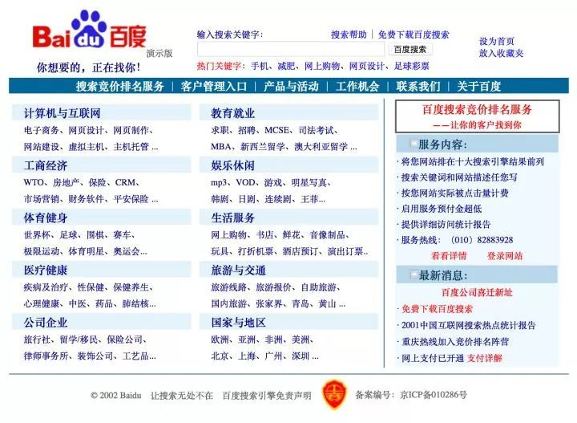

# js模块化规范

`JavaScript`起初定位是在静态HTML页面上添加一些动态效果。

Brendan Eich 在短短10天时间，设计出来的`JavaScript`语言，本身没有提供模块系统。

前端经过十多年的发展，已经从原始走向现代，甚至引领潮流。

网站逐渐变成了互联网应用程序，代码量飞速增长，为了支撑这种需求和变化，同时兼顾代码质量、降低开发成本，接入模块化势在必行。

## 什么是前端模块化？

模块化开发，一个模块就是一个实现特定功能的文件。

有了模块我们就可以更方便的使用别人的代码，要用什么功能，就加载什么模块。

模块化开发的4点好处：

* 避免变量污染，命名冲突

* 提高代码复用率

* 提高维护性

* 依赖关系的管理

## 前端模块化演变过程

### 无模块化时代

在ajax还未提出之前，js还只是一种“玩具语言”，由Brendan Eich花了不到十天时间发明，用来在网页上进行表单校验、实现简单的动画效果等等。

你可以回想一下那个网页上到处有公告块飘来飘去的时代。




这个时候并没有前端工程师，服务端工程师只需在页面上随便写写js就能搞定需求。那个时候的前端代码大概像这样：

```
if(xx){
     //.......
}
else{
     //xxxxxxxxxxx
}
for(var i=0; i<10; i++){
     //........
}
element.onclick = function(){
     //.......
}
```

代码简单的堆在一起，只要能从上往下依次执行就可以了。

### 模块萌芽时代

2006年，ajax的概念被提出，前端拥有了主动向服务端发送请求并操作返回数据的能力。

随着Google将此概念的发扬光大，传统的网页慢慢的向“富客户端”发展。

前端的业务逻辑越来越多，代码也越来越多，于是一些问题就暴漏了出来：

* 全局变量的灾难

小明定义了 i=1
小刚在后续的代码里：i=0
小明在接下来的代码里：if(i==1){...} //悲剧

* 函数命名冲突

项目中通常会把一些通用的函数封装成一个文件，常见的名字有utils.js、common.js...

小明定义了一个函数：function formatData(){   }
小刚想实现类似功能，于是这么写：function formatData2(){   }
小光又有一个类似功能，于是：function formatData3(){   }
...

避免命名冲突就只能这样靠丑陋的方式人肉进行。

* 依赖关系不好管理

b.js依赖a.js，标签的书写顺序必须是：

```
<script type="text/javascript" src="a.js"></script>
<script type="text/javascript" src="b.js"></script>
```

顺序不能错，也不能漏写某个。在多人开发的时候很难协调。

这个时代的解决方案有：

* 用自执行函数来包装代码

```
modA = function(){
     var a,b; //变量a、b外部不可见
     return {
          add : function(c){
               a + b + c;
          },
          format: function(){
               //......
          }
     }
}()
```

这样function内部的变量就对全局隐藏了，达到是封装的目的。但是这样还是有缺陷的，modA这个变量还是暴漏到全局了，随着模块的增多，全局变量还是会越来越多。

* java风格的命名空间

为了避免全局变量造成的冲突，人们想到或许可以用多级命名空间来进行管理，于是，代码就变成了这个风格：

```
app.util.modA = xxx;
app.tools.modA = xxx;
app.tools.modA.format = xxx;
```

Yahoo的YUI早期就是这么做的，调用的时候不得不这么写：

```
app.tools.modA.format();
```

这样调用函数，写写都会觉得恶心，所以这种方式并没有被很多人采用，YUI后来也不用这种方式了。

* jQuery风格的匿名自执行函数

```
(function(window){
    //代码

    window.jQuery = window.$ = jQuery;//通过给window添加属性而暴漏到全局
})(window);
```

jQuery的封装风格曾经被很多框架模仿，通过匿名函数包装代码，所依赖的外部变量传给这个函数，在函数内部可以使用这些依赖，然后在函数的最后把模块自身暴漏给window。

如果需要添加扩展，则可以作为jQuery的插件，把它挂载到$上。

这种风格虽然灵活了些，但并未解决根本问题：所需依赖还是得外部提前提供、还是增加了全局变量。

### 模块化面临什么问题？

从以上的尝试中，可以归纳出js模块化需要解决那些问题：

* 如何安全的包装一个模块的代码？（不污染模块外的任何代码）
* 如何唯一标识一个模块？
* 如何优雅的把模块的API暴漏出去？（不能增加全局变量）
* 如何方便的使用所依赖的模块？

围绕着这些问题，js模块化开始了一段艰苦而曲折的征途。

## 源自Node.js的规范的CommonJS（同步加载模块）

2009年，美国程序员Ryan Dahl创造了 Node.js 项目，将 javascript 语言用于服务器端编程。

这标志"Javascript模块化编程"正式诞生。

因为老实说，在浏览器环境下，没有模块也不是特别大的问题，毕竟网页程序的复杂性有限。

但是在服务器端，一定要有模块，与操作系统和其他应用程序互动，否则根本没法编程。

NodeJS是 CommonJS 规范的实现，webpack 也是以 CommonJS 的形式来书写。

大牛云集的 CommonJs 社区发力，制定了[Modules/1.0](http://wiki.commonjs.org/wiki/Modules/1.0) 规范，首次定义了一个模块应该长啥样。

允许模块通过require方法来同步加载所要依赖的其他模块，然后通过 `exports` 或 `module.exports` 来导出需要暴露的接口。

* 使用方式：

```
// 导入
require("module");
require("../app.js");
// 导出
exports.getStoreInfo = function() {};
module.exports = someValue;
```

优点：

* 简单容易使用
* 服务器端模块便于复用

缺点:

* 同步加载方式不适合在浏览器环境中使用，同步意味着阻塞加载，浏览器资源是异步加载的
* 不能非阻塞的并行加载多个模块

## 服务端向前端进军

Modules/1.0规范源于服务端，无法直接用于浏览器端，原因表现为：

* 外层没有function包裹，变量全暴漏在全局
* 资源的加载方式与服务端完全不同。服务端require一个模块，直接就从硬盘或者内存中读取了，消耗的时间可以忽略。而浏览器则不同，需要从服务端来下载这个文件，然后运行里面的代码才能得到API，需要花费一个http请求，也就是说，require后面的一行代码，需要资源请求完成才能执行。由于浏览器端是以插入<script>标签的形式来加载资源的（ajax方式不行，有跨域问题），没办法让代码同步执行，所以像commonjs那样的写法会直接报错。

所以，社区意识到，要想在浏览器环境中也能模块化，需要对规范进行升级。顺便说一句，CommonJs原来是叫ServerJs，从名字可以看出是专攻服务端的，为了统一前后端而改名CommonJs。

而就在社区讨论制定下一版规范的时候，内部发生了比较大的分歧，分裂出了三个主张，渐渐的形成三个不同的派别：

* Modules/1.x派

这一波人认为，在现有基础上进行改进即可满足浏览器端的需要，既然浏览器端需要function包装，需要异步加载，那么新增一个方案，能把现有模块转化为适合浏览器端的就行了，有点像“保皇派”。

基于这个主张，制定了[Modules/Transport](http://wiki.commonjs.org/wiki/Modules/Transport)规范，提出了先通过工具把现有模块转化为复合浏览器上使用的模块，然后再使用的方案。

`browserify` 就是这样一个工具，可以把 `Node.js` 的模块编译成浏览器可用的模块。

目前的最新版是[Modules/1.1.1](http://wiki.commonjs.org/wiki/Modules/1.1.1)，增加了一些require的属性，以及模块内增加module变量来描述模块信息，变动不大。

* Modules/Async派

这一波人有点像“革新派”，他们认为浏览器与服务器环境差别太大，不能沿用旧的模块标准。

既然浏览器必须异步加载代码，那么模块在定义的时候就必须指明所依赖的模块，然后把本模块的代码写在回调函数里。

模块的加载也是通过下载-回调这样的过程来进行，这个思想就是AMD的基础，由于“革新派”与“保皇派”的思想无法达成一致，最终从CommonJs中分裂了出去，独立制定了浏览器端的js模块化规范[AMD（Asynchronous Module Definition）](https://github.com/amdjs/amdjs-api/wiki/AMD)

本文后续会继续讨论AMD规范的内容。

* Modules/2.0派

这一波人有点像“中间派”，既不想丢掉旧的规范，也不想像AMD那样推到重来。

他们认为，Modules/1.0固然不适合浏览器，但它里面的一些理念还是很好的，（如通过require来声明依赖），新的规范应该兼容这些，AMD规范也有它好的地方（例如模块的预先加载以及通过return可以暴漏任意类型的数据，而不是像commonjs那样exports只能为object），也应采纳。

最终他们制定了一个[Modules/Wrappings](http://wiki.commonjs.org/wiki/Modules/Wrappings)规范，此规范指出了一个模块应该如何“包装”。

使用该规范的例子看起来像这样：

```
//可以使用exprots来对外暴漏API
module.declare(function(require, exports, module)
{
    exports.foo = "bar";
});

//也可以直接return来对外暴漏数据
module.declare(function(require)
{
return { foo: "bar" };
});

```

## AMD/RequireJs（异步加载模块）

AMD的思想正如其名，异步加载所需的模块，然后在回调函数中执行主逻辑。

这正是我们在浏览器端开发所习惯了的方式，其作者亲自实现了符合AMD规范的requirejs，AMD/RequireJs迅速被广大开发者所接受。

代码大概是这样：

```
//a.js
define(function(){
     console.log('a.js执行');
     return {
          hello: function(){
               console.log('hello, a.js');
          }
     }
});
//b.js
define(function(){
     console.log('b.js执行');
     return {
          hello: function(){
               console.log('hello, b.js');
          }
     }
});
//main.js
require(['a', 'b'], function(a, b){
     console.log('main.js执行');
     a.hello();
     $('#b').click(function(){
          b.hello();
     });
})

```


上面的main.js被执行的时候，会有如下的输出：

```
a.js执行
b.js执行
main.js执行
hello, a.js
```

在点击按钮后，会输出：
```
hello, b.js
```

这结局，如你所愿吗？大体来看，是没什么问题的，因为你要的两个hello方法都正确的执行了。
但是如果细细来看，b.js被预先加载并且预先执行了，（第二行输出），b.hello这个方法是在点击了按钮之后才会执行，如果用户压根就没点，那么b.js中的代码应不应该执行呢？
这其实也是AMD/RequireJs被吐槽的一点，预先下载没什么争议，由于浏览器的环境特点，被依赖的模块肯定要预先下载的。问题在于，是否需要预先执行？如果一个模块依赖了十个其他模块，那么在本模块的代码执行之前，要先把其他十个模块的代码都执行一遍，不管这些模块是不是马上会被用到。这个性能消耗是不容忽视的。
另一点被吐槽的是，在定义模块的时候，要把所有依赖模块都罗列一遍，而且还要在factory中作为形参传进去，要写两遍很大一串模块名称，像这样：

```
define(['a', 'b', 'c', 'd', 'e', 'f', 'g'], function(a, b, c, d, e, f, g){  ..... })

```

编码过程略有不爽。
好的一点是，AMD保留了commonjs中的require、exprots、module这三个功能（上面提到的第4条）。你也可以不把依赖罗列在dependencies数组中。而是在代码中用require来引入，如下：

```
define(function(){
     console.log('main2.js执行');

     require(['a'], function(a){
          a.hello();
     });

     $('#b').click(function(){
          require(['b'], function(b){
               b.hello();
          });
     });
});
```

我们在define的参数中未写明依赖，那么main2.js在执行的时候，就不会预先加载a.js和b.js，只是执行到require语句的时候才会去加载，上述代码的输出如下：
main2.js执行
a.js执行
hello, a.js
可以看到b.js并未执行，从网络请求中看，b.js也并未被下载。只有在按钮被点击的时候b.js才会被下载执行，并且在回调函数中执行模块中的方法。这就是名副其实的“懒加载”了。


这样的懒加载无疑会大大减轻初始化时的损耗（下载和执行都被省去了），但是弊端也是显而易见的，在后续执行a.hello和b.hello时，必须得实时下载代码然后在回调中才能执行，这样的用户体验是不好的，用户的操作会有明显的延迟卡顿。
但这样的现实并非是无法接受的，毕竟是浏览器环境，我们已经习惯了操作网页时伴随的各种loading。。。

### CMD/seajs

既然requirejs有上述种种不甚优雅的地方，所以必然会有新东西来完善它，这就是后起之秀seajs，seajs的作者是国内大牛淘宝前端步道者玉伯。seajs全面拥抱Modules/Wrappings规范，不用requirejs那样回调的方式来编写模块。而它也不是完全按照Modules/Wrappings规范，seajs并没有使用declare来定义模块，而是使用和requirejs一样的define，或许作者本人更喜欢这个名字吧。（然而这或多或少又会给人们造成理解上的混淆），用seajs定义模块的写法如下：

```
//a.js
define(function(require, exports, module){
     console.log('a.js执行');
     return {
          hello: function(){
               console.log('hello, a.js');
          }
     }
});
//b.js
define(function(require, exports, module){
     console.log('b.js执行');
     return {
          hello: function(){
               console.log('hello, b.js');
          }
     }
});

//main.js
define(function(require, exports, module){
     console.log('main.js执行');

     var a = require('a');
     a.hello();

     $('#b').click(function(){
          var b = require('b');
          b.hello();
     });

});

```

定义模块时无需罗列依赖数组，在factory函数中需传入形参require,exports,module，然后它会调用factory函数的toString方法，对函数的内容进行正则匹配，通过匹配到的require语句来分析依赖，这样就真正实现了commonjs风格的代码。
上面的main.js执行会输出如下：

```
main.js执行
a.js执行
hello, a.js
```

a.js和b.js都会预先下载，但是b.js中的代码却没有执行，因为还没有点击按钮。当点击按钮的时候，会输出如下：
```
b.js执行
hello, b.js
```
可以看到b.js中的代码此时才执行。这样就真正实现了“就近书写，延迟执行“，不可谓不优雅。

### 面向未来的ES6模块标准

既然模块化开发的呼声这么高，作为官方的ECMA必然要有所行动，js模块很早就列入草案，终于在2015年6月份发布了ES6正式版。然而，可能由于所涉及的技术还未成熟，ES6移除了关于模块如何加载/执行的内容，只保留了定义、引入模块的语法。所以说现在的ES6 Module还只是个雏形，半成品都算不上。但是这并不妨碍我们先窥探一下ES6模块标准。
定义一个模块不需要专门的工作，因为一个模块的作用就是对外提供API，所以只需用exoprt导出就可以了：

```
//方式一, a.js
export var a = 1;
export var obj = {name: 'abc', age: 20};
export function run(){....}

//方式二, b.js
var a = 1;
var obj = {name: 'abc', age: 20};
function run(){....}
export {a, obj, run}

```

使用模块的时候用import关键字，如：
```
import {run as go} from  'a'
run()
```
如果想要使用模块中的全部API，也可以不必把每个都列一遍，使用module关键字可以全部引入，用法：
```
module foo from 'a'
console.log(foo.obj);
a.run();
```

在花括号中指明需使用的API，并且可以用as指定别名。

ES6 Module的基本用法就是这样，可以看到确实是有些薄弱，而且目前还没有浏览器能支持，只能说它是面向未来了。

目前我们可以使用一些第三方模块来对ES6进行编译，转化为可以使用的ES5代码，或者是符合AMD规范的模块，例如ES6 module transpiler。

另外有一个项目也提供了加载ES6模块的方法，[es6-module-loader](https://github.com/ModuleLoader/es6-module-loader)。

不过这都是一些临时的方案，或许明年ES7一发布，模块的加载有了标准，浏览器给与了实现，这些工具也就没有用武之地了。

未来还是很值得期待的，从语言的标准上支持模块化，js就可以更加自信的走进大规模企业级开发。

## Q/A

### require与import的区别

require使用与CommonJs规范，import使用于Es6模块规范；所以两者的区别实质是两种规范的区别；

* CommonJS：

    * 对于基本数据类型，属于复制。即会被模块缓存；同时，在另一个模块可以对该模块输出的变量重新赋值。
    * 对于复杂数据类型，属于浅拷贝。由于两个模块引用的对象指向同一个内存空间，因此对该模块的值做修改时会影响另一个模块。
    * 当使用require命令加载某个模块时，就会运行整个模块的代码。
    * 当使用require命令加载同一个模块时，不会再执行该模块，而是取到缓存之中的值。也就是说，CommonJS模块无论加载多少次，都只会在第一次加载时运行一次，以后再加载，就返回第一次运行的结果，除非手动清除系统缓存。
    * 循环加载时，属于加载时执行。即脚本代码在require的时候，就会全部执行。一旦出现某个模块被"循环加载"，就只输出已经执行的部分，还未执行的部分不会输出。

* ES6模块

    * ES6模块中的值属于【动态只读引用】。
    * 对于只读来说，即不允许修改引入变量的值，import的变量是只读的，不论是基本数据类型还是复杂数据类型。当模块遇到import命令时，就会生成一个只读引用。等到脚本真正执行时，再根据这个只读引用，到被加载的那个模块里面去取值。
    * 对于动态来说，原始值发生变化，import加载的值也会发生变化。不论是基本数据类型还是复杂数据类型。
    * 循环加载时，ES6模块是动态引用。只要两个模块之间存在某个引用，代码就能够执行。

最后：require/exports 是必要通用且必须的；因为事实上，目前你编写的 import/export 最终都是编译为 require/exports 来执行的。


