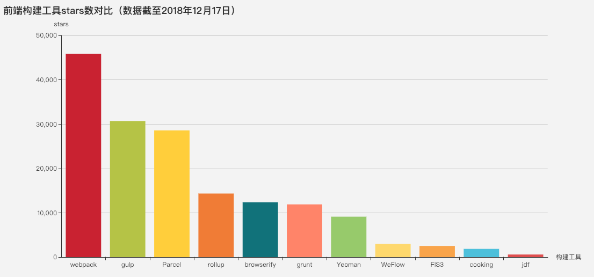
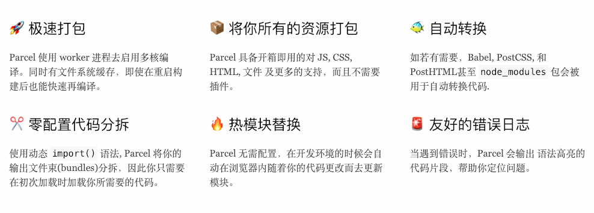

# 常用前端构建工具介绍

构建工具的主要功能就是实现自动化处理，例如对代码进行检查、预编译、合并、压缩；生成雪碧图、sourceMap、版本管理；运行单元测试、监控等，当然有的工具还提供模块化、组件化的开发流程功能。

网上各类的构建工具非常多，有家喻户晓的 Grunt、Gulp、Webpack，也有各大公司团队开源的构建工具，这里通过 Github 的 Star 数量来简单的对比下各个工具的流行度：

截止2018年12月17日数据：

* [webpack](https://github.com/webpack/webpack) star: 45848
* [gulp](https://github.com/gulpjs/gulp) star: 30698
* [Parcel](https://github.com/parcel-bundler/parcel) star: 28580
* [rollup](https://github.com/rollup/rollup) star: 14345
* [browserify](https://github.com/browserify/browserify) star: 12371
* [grunt](https://github.com/gruntjs/grunt) star: 11899
* [Yeoman](https://github.com/yeoman/yeoman) star: 9124
* [WeFlow](https://github.com/Tencent/WeFlow) star: 3013 腾讯
* [FIS3](https://github.com/fex-team/fis3) star: 2527
* [cooking](https://github.com/ElemeFE/cooking) star: 1860
* [jdf](https://github.com/putaoshu/jdf) star: 596

## 前端构建工具

如果把工具按类型分可以分为这三类：

* 基于任务运行的工具：
Grunt、Gulp
它们会自动执行指定的任务，就像流水线，把资源放上去然后通过不同插件进行加工，它们包含活跃的社区，丰富的插件，能方便的打造各种工作流。

* 基于模块化打包的工具：
Browserify、Webpack、rollup.js
有过 Node.js 开发经历的应该对模块很熟悉，需要引用组件直接一个 require  就 OK，这类工具就是这个模式，还可以实现按需加载、异步加载模块。

* 整合型工具：
Yeoman、FIS、jdf、Athena、cooking、weflow
使用了多种技术栈实现的脚手架工具，好处是即开即用，缺点就是它们约束了技术选型，并且学习成本相对较高。

### Parcel

Parcel 是 Web 应用打包工具，适用于经验不同的开发者。它利用多核处理提供了极快的速度，并且不需要任何配置。

Parcel 可以使用任何类型的文件作为入口，但是最好还是使用 HTML 或 JavaScript 文件。如果在 HTML 中使用相对路径引入主要的 JavaScript 文件，Parcel 也将会对它进行处理将其替换为相对于输出文件的 URL 地址。

基于一个合理大小的应用，包含1726个模块，6.5M 未压缩大小。在一台有4个物理核心 CPU 的 2016 MacBook Pro 上构建。

|打包工具|时间|
| --- | ---|
|browserify|22.98s|
|webpack|20.71s|
|parcel|9.98s|
|parcel - with cache|2.64s|

[Parcel使用文档](https://parceljs.org/getting_started.html)

## TODO WebPack和Grunt以及Gulp相比有什么特性

其实Webpack和另外两个并没有太多的可比性：Gulp/Grunt是一种能够优化前端的开发流程的工具，而WebPack是一种模块化的解决方案，不过Webpack的优点使得Webpack可以替代Gulp/Grunt类的工具。

Grunt和Gulp的工作方式是：在一个配置文件中，指明对某些文件进行类似编译，组合，压缩等任务的具体步骤，这个工具之后可以自动替你完成这些任务。

Webpack的工作方式是：把你的项目当做一个整体，通过一个给定的主文件（如：index.js），Webpack将从这个文件开始找到你的项目的所有依赖文件，使用loaders处理它们，最后打包为一个浏览器可识别的JavaScript文件。

gulp是基于流的构建工具：all in one的打包模式，输出一个js文件和一个css文件，优点是减少http请求，万金油方案。

webpack是模块化管理工具，使用webpack可以对模块进行压缩、预处理、打包、按需加载等。

## 参考

* [Web Bundler CheatSheet, 选择合适的构建打包工具](https://zhuanlan.zhihu.com/p/37267736)
