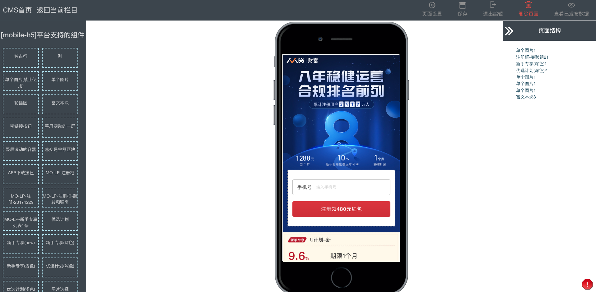
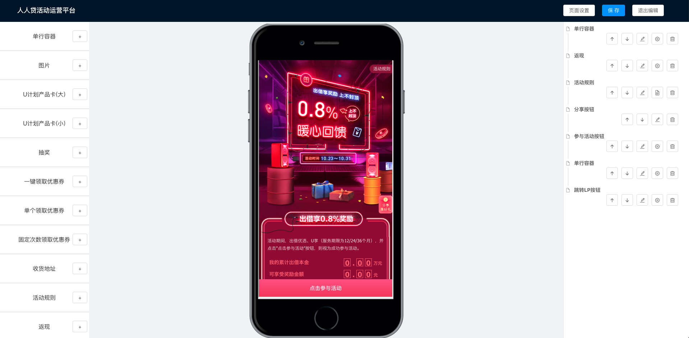
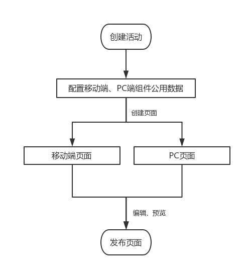
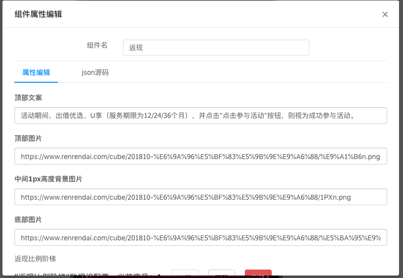
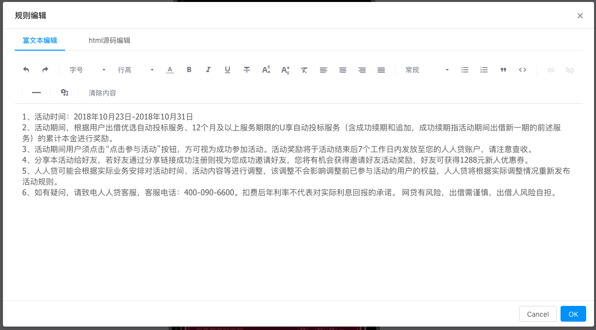

***

>人人贷活动运营平台，是人人贷市场运营部门的重要工具，是一个承担了构建大部分活动页面的Web系统。

# 一、背景

互联网时代，一个公司的发展速度，很大程度上取决于公司市场运营部门。特别是人人贷所属的P2P行业，由于合规要求，不能在电子渠道以外的物理场所进行宣传，更加依赖线上运营，会产生大量的活动运营开发需求。

## 越来越多的活动需求

人人贷的运营活动页面，主要是为了拉新和吸引用户投资。

随着公司运营体系的日益完善，产品部门每个月会提出2到3个活动页面的开发需求，加上几乎每个月都需要迭代的邀请好友页面，再加上每个月会根据实际销量来临时投放活动，前端部门面临的活动开发需求越来越多。

## 活动页面开发人力瓶颈

开发一个活动，需要产品、设计、开发、测试多部门的人员参与，正常情况下，从产品提出需求，设计需要 2人 * 2d，开发需要 3人 * 2d（移动端页面、PC端页面、后端接口开发、接口联调），测试需要 2人 * 2d 投入。这样，从需求提出到页面上线，需要6个工作日。

遇到设计人力比较紧张，而上线时间又不能推迟时，只能压缩开发和测试的时间。而且很多活动都涉及Macbook Pro，iPhone等贵重奖品发放，测试时间就得保障。最后通常都得压缩开发人员的时间，而后端接口的开发，不依赖设计稿，可以和设计同步，所以主要的压力都在前端开发同学这边。

其实，活动页面在技术上来说，并没有太过复杂。对前端团队来说，时间紧，页面开发需求多，部分需求的反复修改，还是让前端团队感到压力。

# 二、构建高效活动运营开发模式

经过分析，我们发现大部分的活动页面，活动形式都是比较固定的，基本上都能划分为产品卡、优惠券、返现、抽奖、排行榜、分享等模块。

在开发过程中，有的小伙伴将一部分功能开发成 `widget` 形式，在不同的 `page` 中通过不同的参数调用 `widget`，也就是一个简易的组件模式，想以此减少开发时间。

但是由于不同设计师的风格不一致，相同功能的模块的结构也不一致，导致开发的`widget`复用率很低。

其实在2年前，前端部门就已经开发了一套 `PageBuilder`(Node.js + jQuery) 系统，集成到了公司的CMS系统(Node.js + React)中，可以用来配置拉新所需的LP注册页面。

这个系统中，开发了注册框组件，产品卡组件，图片组件等常用的组件。



能不能在这个系统中继续添加组件，来实现构建活动页面呢？

通过紧张的讨论，我们发现原有的 `PageBuilder` 系统有一些局限性：

* 使用基于 `FIS` 的 `grape-cli` 编译工具，对于一些 `ES6` 的语法编译不友好

* 原有的系统，使用内部开发的 `grapejs`（基于express.js开发）框架，`Node.js`版本是`5.3.0`，升级成本较大

* 因为LP组件的配置项较少，直接让运营人员编辑json，但是活动组件的配置项特别多，配置过程不是特别友好

* 组件开发的流程不太友好：组件采用npm包的方式，需要发布后才能预览

最后参考了业界的一些关于运营平台的文章，我们决定重新开发一套页面构建系统，一套专门为生成活动页面设计的系统。



## 系统架构

整个活动运营平台的架构图如下：


在业务层，整个运营平台系统分为 `活动运营平台` 、 `rrd-h5` 、`rrd-pc` 三个系统。

`活动运营平台` 是运营创建、编辑、发布活动页面的系统，属于内部系统，也就是文章后面提到的`编辑系统`。

`rrd-h5` 和 `rrd-pc` 是对外的系统，它们是对生成的活动页面数据进行渲染，然后提供给用户进行访问，也就是文章后面提到的`前端框架`。

在后台服务上，由于活动的复杂度并不是太高，我们有很大一部分接口，比如抽奖、记录收获地址，只是做一些简单的存储或者计算，就直接使用了`Node.js`实现，也就是图中的`node-marketing`服务。

而部分与公司主营业务相关的接口，比如投资返现这类，还是直接使用后端提供的接口。

下面，具体介绍一下业务层的系统。

### 活动运营平台



#### 活动与页面配置分离

活动运营平台上，需要先创建活动，然后才能创建该活动对应的移动端、PC端页面。

这是因为一个活动，是可以对应多个推广页面，这些推广页面共享这个活动的配置（活动时间，公用组件配置等）。

数据存储上看，我们新建了 `activity` 、 `page` 、 `page_record` 三张表。

* `activity` 是活动信息表，负责记录活动的上下线时间、公用组件配置等
* `page` 是页面信息表，新建页面时，会在该表中插入数据，需要记录页面所属的平台（移动端 or PC端），发布时间，最重要的，是记录线上页面使用的 record_id ，方便查找线上页面使用的页面数据
* `page_record` 是页面记录表，主要负责记录页面添加的组件数据。在平台上，每一次保存页面，都会在这个表中插入一条数据，这样方便查找编辑记录，如果遇到编辑遇到问题，也方便回滚

#### 组件库与编辑系统、前端框架解耦

运营平台采用了业界通用的 `组件化` 方案，并且选用 `React.js` 作为组件的开发库。

我们使用 npm 包的方式，对组件库进行拆分和版本管理。我们将组件库拆分为 `jm-common` 、`jm-mobile` 、`jm-pc` 三个 npm 包，分别对应两端公用组件、移动端组件、PC端组件。

我们的`编辑系统`定位为`可视化编辑平台`，在对组件进行配置后，所有修改需要在编辑页面实时展示。前端框架更不用说，在页面加载完数据后，需要对组件数据进行渲染。正因为组件库在`编辑系统`和`前端框架`上都会使用，需要解耦。

参照我们之前 `PageBuilder`系统中的组件开发经验，组件库在一个单独的仓库中，在 `编辑系统` 和 `前端框架` 同时引用需要的 组件npm包后，才能确保渲染的一致性。这种设计有个缺陷，那就是每次修改代码，预览效果变的很麻烦。

经过讨论，为了方便组件的开发和预览，我们将组件库的源码集成到了编辑系统的代码仓库中。`编辑系统`通过组件库源码来加载组件库，当组件的代码有修改，`编辑系统`能直接通过重新编译，刷新页面预览到组件。组件库还通过环境判断，会自动在`编辑系统中`使用模拟数据，方便了组件开发时的测试。当组件确认没有问题后，就可以发布在私有的npm仓库中，`前端框架`更新所依赖的组件库版本，就能加载到新的组件。

#### 组件数据的解析与渲染

开发一个组件，我们一般需要添加三个文件。

以图片组件为例，我们添加`image.jsx`、`image.scss`、`spec.js`，分别是组件的具体实现代码、组件样式文件、组件的配置文件数据。编辑系统通过读取每个组件中的`spec.js`文件，来给不同的组件，提供不同的配置项。

一个活动页面，一般会添加多个组件，而且组件间还可能存在嵌套关系，页面上的组件数据如何组织、解析，是必须要解决的问题。

我们这样定义页面上的组件数据：

```
{
    "dataMap":{
        "id1":{
            "cid":"id1", // 组件id
            "type":"pc_component_1", //组件类型
            "name":"组件一", //组件名
            "platform":"pc", //组件所属的平台
            "acceptChild":true, //是否能添加子组件
            "data":{},//组件数据
            "style":{},//组件样式
            "childs":['id3'] //子组件id
        },
        "id2":{
            "cid":"id2", // 组件id
            "type":"pc_component_2", //组件类型
            "name":"组件二", //组件名
            "platform":"pc", //组件所属的平台
            "acceptChild":false, //是否能添加子组件
            "data":{},//组件数据
            "style":{},//组件样式
            "childs":[] //子组件id
        },
        "id3":{
            "cid":"id3", // 组件id
            "type":"pc_component_3", //组件类型
            "name":"组件三", //组件名
            "platform":"pc", //组件所属的平台
            "acceptChild":false, //是否能添加子组件
            "data":{},//组件数据
            "style":{},//组件样式
            "childs":[] //子组件id
        },
        ...
    },
    "childs": ["id1","id2"] //第一层级的组件id
}
```

页面的组件数据中有`dataMap`和`childs`两个字段。
渲染时，通过 `childs` 字段获取所有第一层级子组件的id，然后在`dataMap`中，根据组件id来查找对应的具体配置，进行渲染。
如果某个组件配置数据中的 `childs` 字段不为空数组，就意味该组件中嵌套了其他组件，就继续通过 `childs` 中的id值来查找配置和渲染子组件。

此外，由于有些组件在移动端和PC端都需要实现，而为了减少配置项，我们将它们的一些关键的公共配置提取到了活动配置中。
比如移动端和PC端都有的优惠券配置，我们将优惠券id，领取方式的配置放到活动配置中，这样还能有效避免因运营人员失误，导致同一个活动，在两端配置的优惠券信息不一样的问题。
这些公共的组件配置数据，在渲染组件前，会和`dataMap`中的组件数据进行合并。

### rrd-h5 & rrd-pc 中如何渲染？

编辑系统中生成的页面数据，如何在前端框架中进行构建？

主流的渲染方式有：

* 加载所有的组件定义，然后通过活动id和页面id获取页面的配置数据，进而动态渲染出页面
* 先通过活动id和页面id获取页面的配置数据，然后按需加载组件，渲染出页面
* 服务器通过页面配置和组件定义，直接在发布时生成静态页面

不同的方案各有优劣。rrd-h5 和 rrd-pc 系统中，我们使用了第一种方案来进行渲染：
我们的线上页面模板，会默认加载所有的组件。以`rrd-h5`为例，会加载所有的公用组件和移动端组件。
接着使用活动页面URL中携带的活动id和页面id，通过 node-market 服务获取活动数据和页面数据。
最后完成页面的渲染。

## 技术栈

下面简单介绍一下`活动运营平台`的技术栈，该系统使用了 `leekjs` 、 `leek-cli` 、 `React.js` 、 `MySQL`等。

首先简单介绍下 `leekjs` 和 `leek-cli`，`leekjs`是一个团队内部基于 `koa2` 开发的一个Node.js框架，支持最新的 Node.js 版本。`leek-cli`是`leekjs`对应的一个脚手架工具，提供快速创建服务，打包编译（webpack）等功能。大家可以在 npm 仓库直接搜索到这两个包。

为了避免反复造轮子，我们使用了很多开源库来完善组件平台的功能。

使用了 `antd` 中的组件，来完成运营平台的大部分页面构建。

我们使用 `MobX` 来管理状态，方便管理各组件间的数据传递。

组件平台中，每个组件的可配置项特别多，组件的配置项，以 `JSON` 格式进行保存和解析。为了方便运营人员操作，我们使用 `react-jsonschema-form` ，来对JSON数据进行描述和定义。



部分组件，比如活动规则，需要使用富文本编辑器，我们使用 `braft-editor` 来实现。



### 部分使用的库

* [leekjs](https://www.npmjs.com/package/leekjs)
* [leek-cli](https://www.npmjs.com/package/leek-cli)
* [antd](https://ant.design/index-cn)
* [MobX](https://cn.mobx.js.org/)
* [react-jsonschema-form](https://github.com/mozilla-services/react-jsonschema-form#readme)
* [react-codemirror2](https://www.npmjs.com/package/react-codemirror2)

## 线上运行情况

从活动运营平台上线两个月的使用情况看，该平台已经支持了近10个活动的页面构建与发布。

而且，页面的构建，只需要运营、设计、测试人员的参与，这样就解放了前后端开发者。

相信在这个平台的继续迭代下，今后测试人员的人力也能释放出来。

目前，在设计人员提供好切图后，运营人员仅需1个小时，就能配置完成活动页面。

活动页面的迭代，也不再需要开发修改代码，并且重新上线，只需要运营人员修改页面配置、组件配置即可完成。

营销活动的开发瓶颈不再存在！

## TODO

目前的运营平台，是以`编辑系统`为主，并提供了少量的查询功能。

我们未来会加入`运营监控`、`报警`，`自动生成活动数据报表`等功能。

为了提高页面渲染效率，考虑到活动页面上图片较多、且切图普遍较大的问题，我们计划在`rrd-h5`、`rrd-pc`中引入 `webp` 、`http2`。

# 总结

* 活动运营平台，让活动的上线周期，从以往的6天，降低到了2天。设计师切完图，运营人员就能配置上线。

* 运营平台规范了活动形式，同时，设计师也会在组件的可编辑范围内进行设计。

* 释放出的前、后端开发人员，能将更多的精力放到技术本身上。

## 参考文章

* [转转运营活动高效开发有哪些秘诀？](https://juejin.im/entry/5a145a4c5188253ee45b13a3)
* [QQ会员活动运营平台演变实践](http://blog.jobbole.com/108252/)
* [页面可视化搭建工具前生今世](https://zhuanlan.zhihu.com/p/37171897)